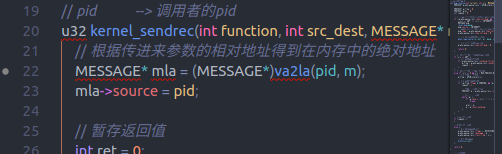
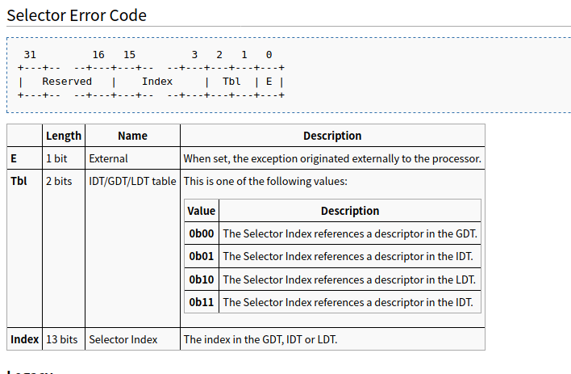
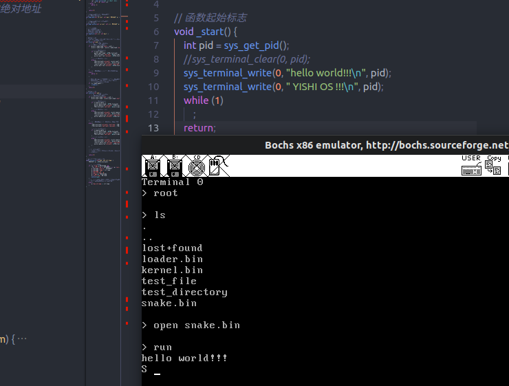

# 内存管理

## 1. 概述

内存管理主要要做的内容如下:

> 1. 为新进程分配内存
> 2. 初始化新进程的 LDT 和 GDT
> 3. 进程的执行与退出  
>    暴露的接口有两个:int execute(fd file, int parent_pid); void exit(int pid);

除此以外 output 进程和时钟中断还需要增加一些东西(为了支持贪吃蛇)

> 1. output 下滚至清屏
> 2. output 根据一段连续的内存刷新界面
> 3. output 根据可变参数(结构体)修改界面中的字符
> 4. 时钟中断设置定时器(以系统调用的方式,时间到后唤醒指定进程)

## 2. 内存管理框架

首先写一个大概的内存服务器框架

执行一个用户程序的流程:

> 1. 调用系统调用,向 MM 发送信息,请求运行一个子进程
> 2. MM 加载文件并重新放置 ELF 文件
> 3. MM 分配空白 PCB 和空闲内存
> 4. 子进程进入挂起队列,把子进程 pid 返回给父进程

一个子进程退出的流程:

> 1. 子进程调用系统调用,向 MM 发送信息,请求退出
> 2. MM 向父进程发送一个信息,表明要退出
> 3. 父进程接受信息并回复
> 4. MM 接收到父进程的回复,释放子进程 PCB 和内存
> 5. 执行一次进程调度

终端执行贪吃蛇的流程:

> 1. 通过 MM 启动贪吃蛇
> 2. 终端不断接收信息  
>     input 子系统信息: 处理后传递给子进程  
>    子进程退出信息: 重新回到初始状态

b 版本,首先写一个能独立运行的用户进程  
这个有一个问题,需要先了解一下 gdb 的工作原理,否则很难对用户程序进行调试(因为用户进程是一个单独的程序,而不是 kernel.bin 的一部分)

或者还有一种方法,就是先在 kernel.bin 中建立一个任务级进程,调试好后再封装成用户进程

总结一下思路如下:

> 1. 先调试一个任务级进程,能用就行那种
> 2. 为了调试内存管理模块,把 1 中的进程编译出一个独立的 elf 文件
> 3. 把独立 elf 文件中的代码替换成贪吃蛇的代码

b 版本中首先调试并编译出一个独立的 elf 文件

## 3. 添加系统调用

> 1. output 下滚至清屏
> 2. output 根据一段连续的内存刷新界面
> 3. output 根据可变参数(结构体)修改界面中的字符
> 4. 时钟中断设置定时器(以系统调用的方式,时间到后唤醒指定进程)

c 版本中 实现 12,不用添加新的系统调用表成员  
只需要在 syscall.h syscall.c 中添加处理函数,再在 output 进程中添加处理方法就好了  
3 暂时先不弄,12 已经够用了

又出现一个问题,在编译 snake.bin 的时候,需要用到 syscall.o,但是 syscall 又需要用到内核变量(内核函数)  
为解决这个问题,在 snake 文件夹中重新写一份纯净版的系统调用函数
修改 makefile,单独编写一个子 makefile 来编译 snake.bin

这一部分在 d 版本中完成

发现一个问题,在之前的系统调用中,有几个在用户态的函数中就使用了内核全局变量,这个是绝对不行的,需要改一下

```c++
// 显示一个字符串
void sys_terminal_write(int console_index, char* data, int pid) {
    MESSAGE message;
    message.source = pid;
    message.type = SERVER_OUTPUT;
    // 下面这一句使用了内核全局变量console_table
    message.u.output_message.console = &console_table[console_index];
    message.u.output_message.data = data;
    message.u.output_message.function = OUTPUT_MESSTYPE_DISP;
    message.u.output_message.pid = pid;
    asm_syscall(SYS_SENDREC, SEND, OUTPUT_SYSTEM, (u32)&message, (u32)pid);
}
```

在 f 版本中改正

> 1. 修改结构体定义,把 output_message.console 从结构体指针改为数字(下标)
> 2. 在 output 进程中修改处理方法

g 版本中实现 4, 这个和前面的不一样,必须通过添加系统调用来完成

> 1. 在时钟中断处理处加一个结构体数组,最大长度为最大进程数
> 2. 结构体有两个成员,一个是剩余 ticks 数, 一个是目标 pid 数
> 3. 每次触发时钟中断,所有 pid 非负者 ticks 减 1
>    如果 ticks 数减至非正,则唤醒目标 pid 对应的进程,并将该结构体中成员 pid 置-1

## 4. 内存管理函数

最后添加内存管理的两个函数

> 调用系统调用,向 MM 发送信息,请求运行一个子进程
> MM 加载文件并重新放置 ELF 文件
> MM 分配空白 PCB 和空闲内存
> 子进程进入挂起队列,把子进程 pid 返回给父进程
>
> 为新进程分配内存
> 初始化新进程的 LDT 和 GDT
> 进程的执行与退出  
> 暴露的接口有两个:int execute(fd file, int parent_pid); void exit(int pid);

在 h 版本添加一个 execute 函数,然后添加系统调用来配套

首先把 proc.c 中那个申请空白 PCB 的函数换到内存管理中,然后添加一个释放 PCB 的函数

execute 函数思路:

> 1. 申请一个空 PCB
> 2. 申请一份空内存
> 3. 连接空白 PCB 和空内存
> 4. 复制文件到缓冲区中
> 5. 根据 ELF 格式重新放置文件,设置 eip 寄存器
> 6. 把 PCB 加入挂起队列中
> 7. 返回子进程 pid

有一个让人非常疑惑的地方,网上都说虚拟地址是页 zh 式存储转换前的地址,也就是说需要改动页表,但是 orange 里并没有这么做,更像是把虚拟地址当做偏移地址了  
又或者是 orange 中 elf 文件格式里写错了,这个不是虚拟地址

h 版本中基本框架弄好了,在 i 版本中开始调试

首先第一个,在读取 inode 节点的时候触发了#PF 错误  
page fault 出现的原因：

> 页表中找不到对应虚拟地址的 PTE(无效地址/有效地址但是没有载入主存)  
> 对应虚拟地址的 PTE 拒绝访问

检查在 FS_get_inode 中各个变量的值  
inode_index == 15  
inode_buf == 0xf000ff53(3GB+)

问题处在 inode_buf,检查在 terminallib.c 中的时候 file_fd.inode 的位置,寻找变量是在哪一步越界的

在 terminal_open()函数总指针的位置就错了  
问题处在终端初始化的过程中  
初始化 file_fd 之后,没有把 terminal 的指针指向它

加上后,open snake.bin 命令成功读取到 snake.bin 的 inode

第二个错误,mem_message 结构体中的 file 变量是 inode 结构体指针,而 terminal 中的 file_fd 是文件描述符指针,这两个不能直接赋值

在执行 read_elf()函数的时候,触发#GP 错误  
/#GP 错误是高特权级进程访问低特权级内存时出现的内存保护错误

没看出来这一句是要干什么,但是删除之后会出错...(开始玄学???),也可能是在调用 ipc 的时候来源没设置,如果没有这一句就会出错



换个思路,在 open snake.bin 的时候,其实进行了磁盘操作,但是没有出现异常,对比两次磁盘操作的不同

对比两次磁盘操作 command 结构体的不同,完全一致,排除磁盘操作的问题

重新整理一下思路,既然是#GP 错误,一定是操作内存错误了,而任务级进程能操作左右的 RAM,那么一定是碰到 ROM 了  
即使多次 open 一个文件也不会出错,说明磁盘一定是没问题的

对换一下(连接空白 PCB 和内存)与(读取文件到缓冲区)两个步骤的顺序

现象是不会出现#GP 错误了,但是也一直卡在空进程上,磁盘没有触发中断

再进一步把读取文件到缓冲区放在第一步

依然卡死了,但是在文件系统中单步调试,发现前 8 个 block 都能正确读取,在最后一个 block 处卡死了

卡住的原因是磁盘每次都读两个扇区,然后把剩余扇区数减 2,如果只读一个扇区,1-2 会下溢出成 255....

修改方法为把 DISK_BUFFER_SIZE 改为一个扇区的大小,然后把每次减 2 改为减 1

盲目优化是万恶之源呀...

现在能正确读取一个文件了,但是还是不清楚为什么 set_pcb()会对 read_elf 造成影响

在触发#GP 的时候,cs 寄存器是 0x08,即 SELECTOR_FLAT_C

想到一个可能引起#GP 的地方:  
显存的描述符特权级为任务级,在初始化用户进程的时候,把 gs 段初始化成了用户级,修改一下试试

没办法在汇编层次调试太头疼了



对比错误码 C 得:

> The Selector Index references a descriptor in the LDT  
> 下标为 1

即 PCB 中的第二个局部描述符有问题

发现一个细节:  
在初始化进程 ldt 的时候,直接与 PRIVILEGE_TASK 与运算了,但是描述符特权位为 56 两位(见 Orange 书 32 页图),也就是说这么写的话特权级都是 0(内核级),数据段选择子以用户级的 RPL 访问内核级的 LDT 肯定会出问题的  
解决办法为左移 5 位

```c++
    proc->ldt_sel = selector_ldt;
    init_descriptor(&proc->ldts[0], segment_base, MM_BLOCK_SIZE >> 3,
                    DESEC_ATTR_CODE_E | DESEC_ATTR_32 | DESEC_ATTR_LIMIT_4K |
                        PRIVILEGE_TASK);
    init_descriptor(&proc->ldts[1], segment_base, MM_BLOCK_SIZE >> 3,
                    DESEC_ATTR_DATA_RW | DESEC_ATTR_32 | DESEC_ATTR_LIMIT_4K |
                        PRIVILEGE_TASK);
```

啊啊啊啊啊啊成了成了,没有再触发#GP 错误

到这里,基本完成了运行一个用户程序,但是用户程序使用系统调用还有一小点问题,在 j 版本中再修改一下

## 5. 调整系统调用

基本所有的问题都出现在一点上: 指针的从偏移地址到全局地址的转换

1. ipc 中进入的时候把原消息进行了转换,但是在后面的 send 函数又进行了一次转换,导致错误,同理该函数后面的同类错误

   ```c++
           // 原代码
           phys_copy(va2la(dest, destiny->message), va2la(current, m),
                   sizeof(MESSAGE));
           // 修改后
           phys_copy(va2la(dest, destiny->message),m,
                   sizeof(MESSAGE));
   ```

2. 用户程序已经可以使用系统调用了,但是不知道为什么使用 sys_terminal_write()函数的时候,第二个系统调用就出错了

   

试了试,在 terminal 进程中不会出现这种情况  
哦哦哦明白了,因为系统调用中的 message 结构体也是代码的一部分,也就是说同时只能有一个进程使用绘制终端系统调用???

重新写一遍绘制终端系统调用, 传进去一个结构体指针

调整之后依然出现这种情况,如果一共调用三次,13 次是正常的,第 2 次错误  
猜想应该是 ipc 的锅  
问题应该出现在两种情况之一:

> 1. 目标正常运行,发送方自己阻塞的情况
> 2. 当前进程读取,发现有进程正在向自己发送,自己读取并唤醒发送进程
