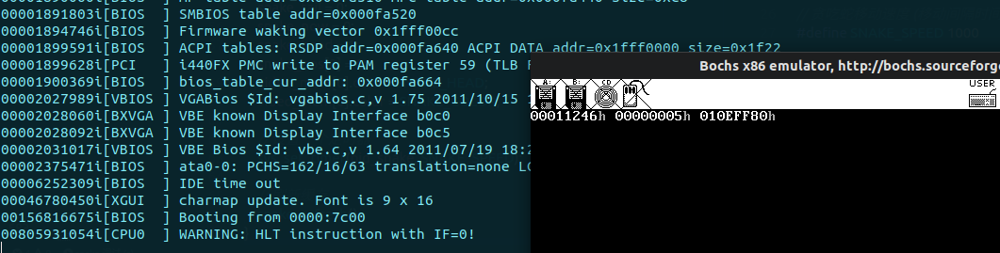

# 贪吃蛇

## 1. 概述

总体思路

> 1. 主循环不断接收消息
> 2. 如果消息来自终端,则为控制消息,根据按键类型控制游戏
> 3. 如果消息来自定时器,则为时钟消息,控制贪吃蛇动一步
> 4. 通过 output 子系统的刷新终端系统调用来控制输出

后续改进

> 1. 添加获取父进程的系统调用,可以在其他终端上运行
> 2. 增加 output 子系统的系统调用,可以控制少数几个字符的变化,而不用刷新所有字符
> 3. 增加游戏控制方式,速度调节等

## 2. 游戏框架搭建

直接停机可还行



应该是没太控制好,碰到了 ROM 区域  
需要找一找那个地方可能出现意外的大数字

先把 helloworld 保存为 a 版本

back.c 文件会出错,使用忒修斯之船的方法来判断哪个地方错了

为什么把函数体放进去就会出错???

把函数体放进去编译出来的结果也没有超过 12kb 呀???

没想到会用到这么多的变量 2000 个显存结构体,2000 个贪吃蛇位置变量

修改文件系统中读取文件的部分,开启一级索引

猜想是对的,虽然编译出来的 snake.bin 不足 12kb,但是就是出错了???

back.c 和 snake.c 互换名字

注意错误的原因: 没有代码或数据


把描述符和选择子全改成用户级后出现这个错误


也就是说 rpl=1 的选择子试图调用 dpl=3 的描述符,产生错误

总之就是各种 RPL!=DPL 引发停机错误

万万没想到在这一步上又栽了,重新补一下权限管理

总结一下,在执行到

```c++
 sys_sendrec(RECEIVE, ANY, &messages[3], pid_snake);
```

这一句的时候,当前特权级为 1,描述符特权级为 3,调用失败

全部改成任务级也会出错,直接重启了...

奇了怪了,为什么同样在一个文件中,有的函数能用有的不能用????
气死我了,直接把代码段权限改为一致内核级代码,所有的程序都能访问那种

这 nm 都什么乱七八糟的


平复心情整理思路:

1. 尝试 1

   > 1. 代码段 DPL: 内核级一致代码段(所有进程都能访问)
   > 2. 数据段 DPL: 用户级数据段(所有进程都能访问)
   > 3. 选择子 DPL: 全部为用户级 RPL

   报错内容: iret: SS.dpl != CS selector RPL  
   即从中断返回的时候,堆栈段描述符 DPL 不等于 CS 选择子的 RPL  
   堆栈段即数据段,DPL == 3  
   CS 选择子应该是内核代码的 CS (用户段 CS RPL==3)

2. 尝试 2

   > 1. 代码段 DPL: 用户级一致代码段(所有进程都能访问)
   > 2. 数据段 DPL: 用户级数据段(所有进程都能访问)
   > 3. 选择子 DPL: 全部为用户级 RPL

   报错内容: check_cs(0x0005): conforming code seg descriptor dpl > cpl, dpl=3, cpl=1  
   即代码段 dpl 大于 cpl  
   dpl == 3 意味着是用户级代码  
   cpl == 1 意味着当前等级为任务级

   同时需要注意一点, 只有 sys_sendrec 这个函数会有这种错误,sys_terminal_write 不会出现这种情况,即使这个函数和 sys_sendrec 同为一个文件夹中的系统调用

   可能是不能直接调用 sys_sendrec 这个函数???  
   这两个调用的区别就是一个是发送信息一个是接收信息  
   也就是说接受信息的时候会出现问题

   接受信息的过程如下:

   > 1. 时钟中断唤醒用户进程,把用户进程放入挂起队列尾
   > 2. 执行一次进程调度,把用户进程放在就绪队列
   > 3. 时钟结束,返回到用户进程

   调试的时候发现,尝试 2 的错误发生在调用 sys_sendrec 的时候

   发现一个小问题,msg_send 函数中发送给在接收的进程的时候,不需要把目标地址的消息指针再转化一次了

   问题出现在 1 结束后向空进程转化的时候,直接死机了

   系统调用全过程:

   > 1. 中断发生
   > 2. 查询 TSS,找到堆栈
   > 3. 自动保存 esp,cs,eflags,eip,ss
   > 4. 手动保存 eax,ebx,ecx,edx...gs
   > 5. 切换到内核栈,保存 PCB 起始位置
   > 6. 把 PCB 起始位置入栈, 把系统调用参数入栈
   > 7. 跳转至系统调用函数
   > 8. 切换到新 PCB 起始位置(作为 esp)(restart 函数处)
   > 9. 加载新的 ldt,设置 TSS 与新的 PCB 的关系
   > 10. 手动恢复 eax,ebx,ecx,edx...gs
   > 11. iretd 指令自动恢复 esp,cs,eflags,eip,ss
   > 12. 运行新进程(如果进程发生了变化)

   问题出现在空进程部分,根本就没碰到在空进程中设置的断点  
   想一想从普通任务级进程进入空进程和从用户进程进入空进程有什么不一样

3. 尝试 3

   > 1. 代码段 DPL: 任务级一致代码段(所有进程都能访问)
   > 2. 数据段 DPL: 用户级数据段(所有进程都能访问)
   > 3. 选择子 DPL: 全部为用户级 RPL

   这应该是一个比较合理的设置  
   错误信息: iret: SS.dpl != CS selector RPL

   堆栈段 DPL 必须等于 CS 选择子的 RPL  
   索性把所有用户进程也设置成任务级

   在执行到 while(1);的时候,触发错误: read_virtual_checks(): read beyond limit , write beyond limit, r/w

   啊真是昏了头了,字节转 4k 的时候需要移位的个数是 12,而不是 3...

   奇了怪了,定义的代码段界限没有问题,为什么 EIP 会超过呢,按道理来说绝对够了呀

   prefetch: EIP [00100000] > CS.limit [000fffff]

   满打满算也不到 30kb 呀...

   

   或者是一共有三个段,两个需要加载,而加载的位置不太对???

   为什么莫名其妙会跑出限定的 1mb 呢???

   找代码越界的条件:

   | 序号 |                     条件                      |                      结果                       |
   | :--: | :-------------------------------------------: | :---------------------------------------------: |
   |  0   | 全部都用局部变量</br>直接输出 8 次 helloworld |                      正常                       |
   |  1   |                0 改为全局变量                 |                      正常                       |
   |  2   |              0 改为全局静态变量               |                      正常                       |
   |  3   |    2 的基础上加上一对定时器和接受信息调用     | prefetch: EIP [00100000] > CS.limit [000fffff]  |
   |  4   |           在 2 的基础上只增加定时器           |                      正常                       |
   |  5   |        在 2 的基础上只增加接受信息调用        | write_virtual_checks(): write beyond limit, r/w |

   发生异常和进程接收信息有关

   而且不是直接崩,计数器依然会工作一会儿  
   把用户进程的内存分配多一点,越界的时候数值也会大一点  
   有个地方很奇怪,为什么 eip 会跑那儿去???  
   同时明明是在空进程中,为什么会以用户进程的界限为界限???

发现一个问题,ipc 中,如果对面阻塞,需要把自己挂载对面的接受信息链上,这一步弄错了,详见 ipc.c 这里相关的代码

日了狗了!!!!!!!!!!!!!!!!!!!!!!!!!!!!!!!!!!!!!!!!!!!!!!!!!!!!!!!!!!!!!!!!!!!!!!!!!!!!!!!!!!!!!!!!!!!!!!!!!!!!!!!!!!!!!!!!!!!!!!!!  
还真是这里的错,改了之后就好了

贴一个宏导致的错误:


为什么呢? 因为宏是直接展开的!!!  
没有考虑计算优先级

有个很大的问题,只有一个终端的时候一切正常,打开第二个中断就崩了...(运行游戏的时候)

e 版本成功运行了,但还有几个缺陷:

> 1. 贪吃蛇无法暂停
> 2. 贪吃蛇无法退出
> 3. 多个终端共享的函数之间会发生冲突(一些局部函数被多个进程使用,会造成混乱)

退出过程:

> 1. 向父进程发送信息,表示退出
> 2. 父进程接收信息并处理
> 3. 向内存管理服务器发送信息,调用退出函数
> 4. 释放内存和 PCB

内存管理退出一个进程的过程:

> 1. 把 PCB 从队列中提取并释放
> 2. 释放内存

其中第二步需要避免中断的影响

f 版本中实现了暂停,退出  
但是没有成功实现运行多个终端同时能打开贪吃蛇  
贪吃蛇多次退出打开后会引发错误(鬼知道是为什么)
刚开始退出再进去就会出错,在设置 PCB 的时候改为初始化所有寄存器,改好了  
但是如果多次退出重入依然有问题
