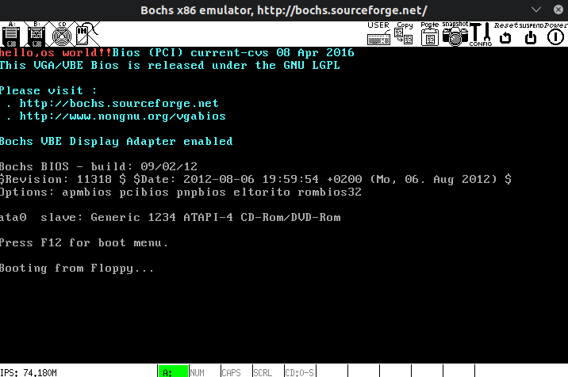
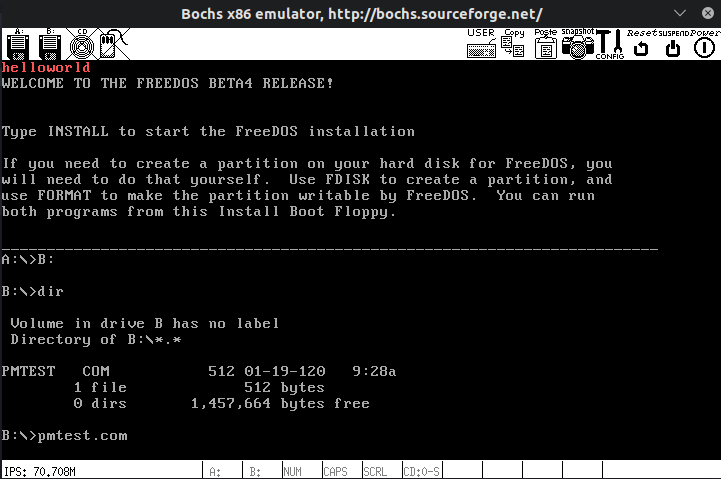

# 环境搭建

> 1. 环境总览
> 2. 参考书籍
> 3. 软件安装
> 4. 软件配置

## 1. 环境总览

1. ubuntu 18.04
2. Visual Studio Code (vscode 真香)
3. bochs 虚拟机 (包括 freedos)
4. nasm 汇编器
5. 汇编金手指 (从学校机房嫖的一个小程序)
6. bximage xxd 等开源小工具

## 2. 参考书籍

1. 《30 天自制操作系统》(川合秀实著)
2. 《Orange'S：一个操作系统的实现》(于渊著)
3. 《操作系统设计及实现》(Tanenbaum 著)
4. NASM 中文手册

## 3. 软件安装

1. wine 安装(为了可以使用汇编金手指)  
   [Ubuntu 18.04 LTS 安装 wine,exe 程序安装和卸载](https://www.cnblogs.com/hyyq/p/9082765.html)  
   [通过安装 wine 在 ubuntu18.04 上运行 exe 文件](https://blog.csdn.net/k_x_k_baoqian/article/details/99676558)  
   [Installing WineHQ packages](https://wiki.winehq.org/Ubuntu)  
   [对 wine 进行配置,补全其缺失的 dll 和字体](https://linux.cn/article-8382-1.html)  
   [windows dll 文件下载网站](https://cn.dll-files.com/)

2. bochs 安装(虚拟机软件,重点是必须通过源码安装打开调试开关)  
   [Ubuntu - 16.04 bochs 安装与配置](https://blog.csdn.net/qq_34072052/article/details/78556406#bochs%E7%9A%84%E5%AE%89%E8%A3%85)

## 4. 软件配置

重点在于设置 bochsrc,使得 bochs 得以找到需要运行的文件

1. 使用自己编写的引导文件启动

   ```text
   # a软驱设置为引导软盘镜像,状态为已插入
   # 设置为从软盘启动
   floppya: 1_44=bibibi.img status=inserted
   boot: floppy
   ```

2. 使用 freedos 运行 dos 系统,在 dos 系统中以 com 文件的形式测试自己写的代码

   ```text
   floppya: 1_44=freedos.img status=inserted
   floppyb: 1_44=bibibi.img status=inserted
   boot: floppya
   ```

3. 都需要设置的配置(否则会报错,这个是根据报错信息得知需要改的内容)

   ```text
   config_interface: textconfig
   display_library: x
   # 下一条重要的是要修改model(即模拟的CPU型号)
   # 可以通过 bochs -help cpu 命令查看支持的CPU型号
   cpu: model=pentium_mmx, count=1, ips=50000000, reset_on_triple_fault=1, ignore_bad_msrs=1, msrs="msrs.def
   #sb16是对音频设备的支持,暂时也用不到,直接注释掉就好
   #sb16: midimode=1, midi=/dev/midi00, wavemode=1, wave=/dev/dsp, loglevel=2, log=/dev/stdout, dmatimer=600000
   #ata0-slave: type=cdrom, path=/dev/cdrom, status=inserted
   ```

## 5. 使用方法

1. 使用 bximage 工具创建虚拟软盘(按照引导操作即可)
2. 使用 dd 命令把引导写入软盘

   ```makefile
   ##################################################
   # Makefile
   ##################################################

   .PHONY : run

   run : yishi.bin
       dd if=yishi.bin of=yishi.img bs=512 count=1 conv=notrunc
       bochs -f bochsrc

   yishi.bin : boot.asm
       nasm -o yishi.bin boot.asm
   ```

   

3. 将 .com 程序挂载在软盘上,通过 freedos 运行程序

   ```makefile
   ##################################################
   # Makefile
   ##################################################

   .PHONY : run

   run : yishi.com
       sudo mount -o loop ./yishi.img /mnt/floppy
       sudo rm -rf /mnt/floppy/*
       sudo cp ./yishi.com /mnt/floppy
       sudo umount /mnt/floppy
       bochs -f bochsrc

   yishi.com : boot.asm
       nasm -o yishi.com boot.asm

   # 进入freedos系统后进入磁盘B,然后运行yishi.com即可
   # 如果是第一次使用磁盘B,先使用format B:命令进行初始化
   ```


