# 启动扇区

> 1. 文件系统格式
> 2. 读取超级块
> 3. 读取根目录

## 1. 文件系统格式

启动扇区的任务是从硬盘/软盘上找到 Loader,加载 Loader 并转移控制权  
Loader 依次完成加载内核,进入保护模式,打开分页机制,转移控制权给内核  
Loader 放在根目录中,而启动扇区负责寻找并加载 Loader,然后转移控制权

建立虚拟硬盘使用 bximage 工具,使用 mkfs.ext2 命令将其格式化为 ext2 文件系统  
将 helloworld 程序编译后写入成功运行  
重新挂载,成功挂载  
说明写入的 MBR 没有影响 ext2 文件系统

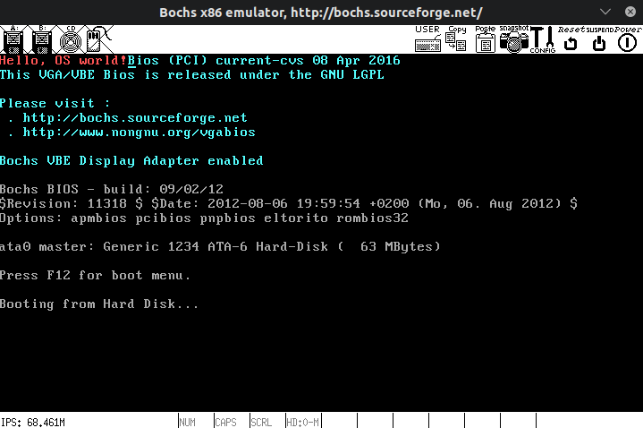

除了书以外比较好的资料  
[Ext2 文件系统结构](http://www.nongnu.org/ext2-doc/ext2.html)  
[Ext2 文件系统简单剖析](https://www.jianshu.com/p/3355a35e7e0a)  
[鸟叔|Linux 磁盘与文件系统管理](http://cn.linux.vbird.org/linux_basic/0230filesystem_6.php)

## 2. 读取超级块

最终期望的内存分布图参照 Orange's OS

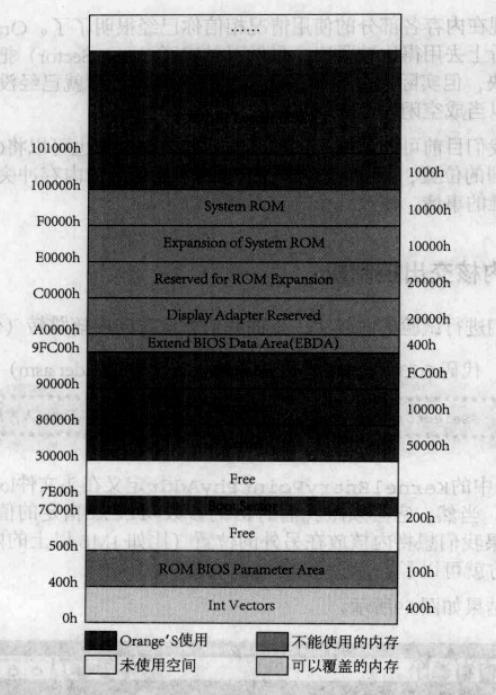

其中 Loader 占用 90000h~9FC00h 位置的内存

磁盘系统结构

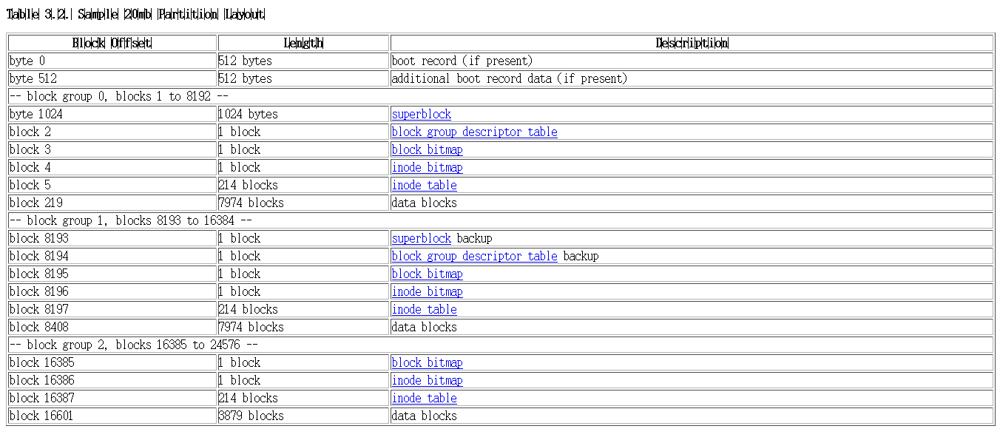

每个分区的 Boot Sector 都只占 1k,且永远与超级块相邻

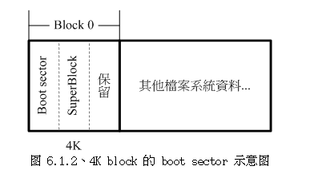

读取磁盘的时候想要参考 Orange's OS,但是遇到了一些问题......

正确使用 Disk Address Packet 的例子为:

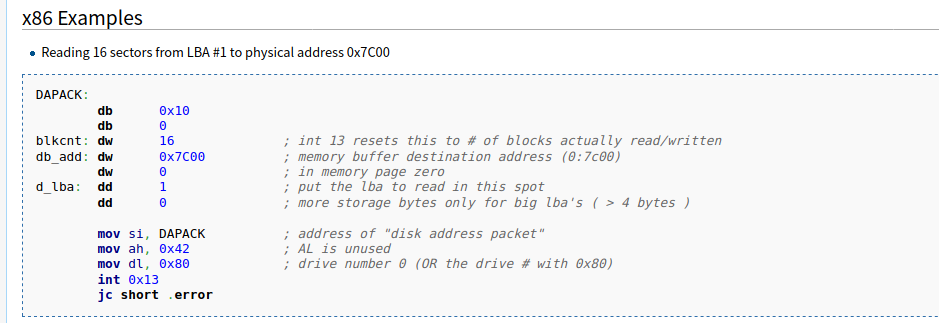

[ATA*in_x86_RealMode*(BIOS)](<https://wiki.osdev.org/ATA_in_x86_RealMode_(BIOS)>)

硬盘中明明有数据,使用 int 13 读进内存就不对了...  
当读取位置为 0:0 是是对的(读取 MBR 数据正确)

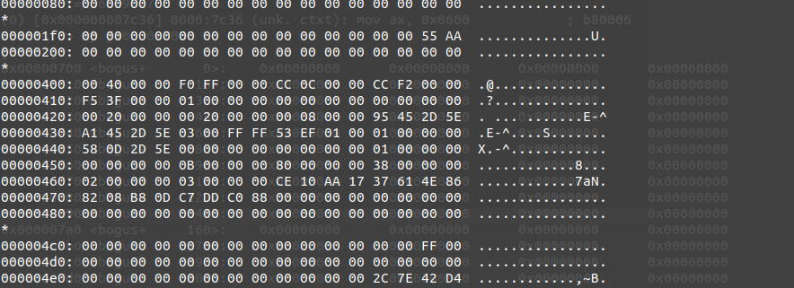  
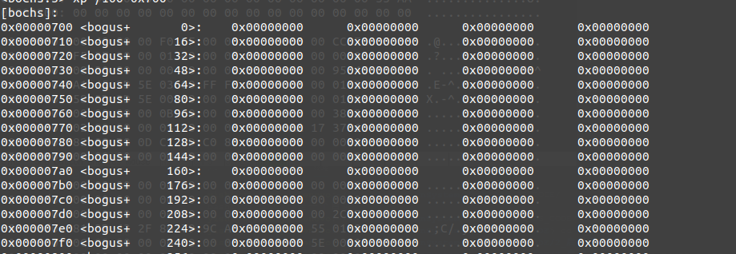

这么看应该是磁盘位置格式有点问题

把磁盘位置的单位看做扇区后正确读取,超级块偏移为 1024,即扇区号为 2

这么看就是 Orange's OS 错了,于渊老哥好像把这个当做是字节了?

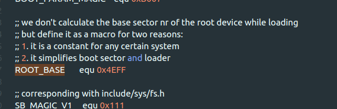  
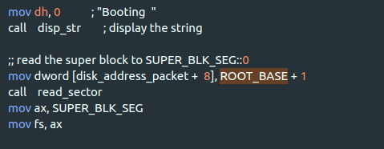

## 3. 读取根目录

关于小端存储与 xxd 工具的显示格式  
以后统一使用命令: xxd -u -a -e -c 16

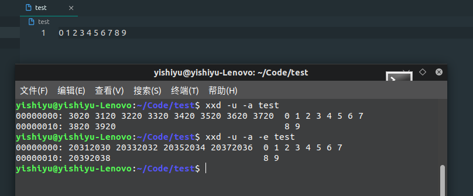

对比超级块中的信息和系统读到的信息

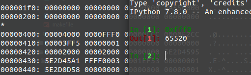  
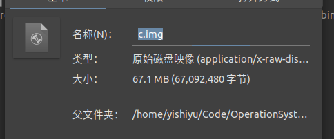

把虚拟硬盘挂载后写入一个 Loader.bin 文件,其中内容先写为"Loader"

这里有一个让人吐血的问题,inode table 的位置可能不按照书上的位置排列...  
inode table 的真正位置在 Group Desriptors 中...

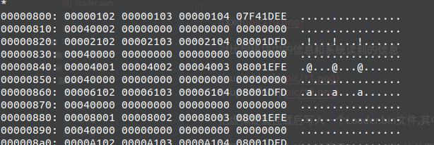

血的教训,使用完段寄存器后一定要恢复原值....改了 ds 寄存器后没有复原....炸了...

成功加载 inode table

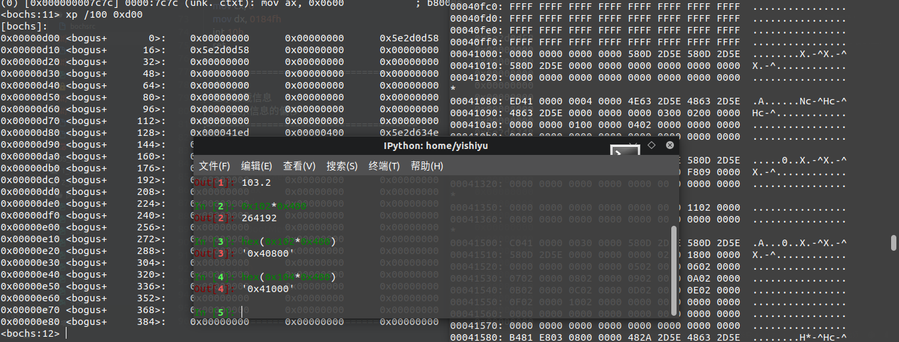

根据根目录 inode(2 号 inode)读取根目录,注意 inode table 中的 inode 从 1 开始编号

有关 inode 结构的资料: [inode](http://www.nongnu.org/ext2-doc/ext2.html#inode-table)

inode 描述的文件的 block 数量存储在 i_blocks 变量处  
但是在这里我们只读取直接直接索引的 block 就行了,毕竟根目录不会很大,而且目录项本身也很小

> inode 40-99 bytes 描述指向数据的 block 号(60bytes 描述了 15 个 block)
> 前 12 个 block 为直接索引
> 第 13 个 block 为一级索引
> 第 14 个 block 为二级索引
> 低 15 个 block 为三级索引

搜索目录时需要逐一对比每个目录项,需要注意其中名字长度为 4 位对齐,且长度可变  
故搜索时应将剩余 block 长度作为循环条件

啊细节真的很重要...  
因为没考虑 lodsb 的副作用,多加了一个 inc 语句....  
表现为名字第一个字能正确对上,第二个永远出错  
因为直接跳到第三个字符去了...

总体流程总结:

> 1. 加载超级块
> 2. 加载 Group Desriptors
> 3. 加载根目录
> 4. 寻找 Loader
> 5. 加载 Loader 并跳转
