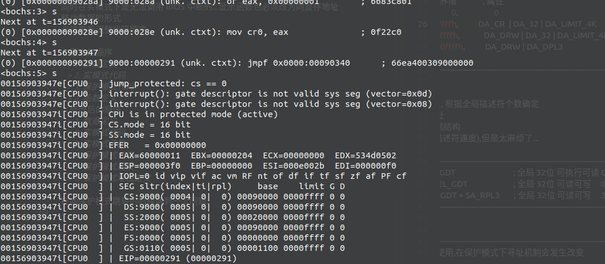
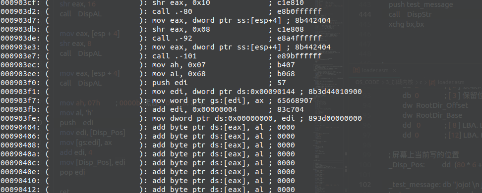

# 加载内核

## 1. 总体安排

Loader 实现功能的安排

> 1. 获取内存的信息
> 2. 搜索并加载 kernel.bin
> 3. 进入保护模式(由于保护模式下仅根据偏移就能寻址 4G 的空间,所以不再在内核中划分不同的段)
> 4. 启动分页机制(根据得到的内存信息, 部分初始化页表)
> 5. 重新放置 kernel (kernel 文件为 elf 格式文件,与引导扇区一样,现在麻烦点可以给以后积累很多可以用的代码)
> 6. 跳转进入 kernel

为了使目录简洁一点,在 makefile 中添加删除中间文件的语句

```makefile
##################################################
# Makefile
##################################################

.PHONY : all

all : run clean

run : boot.bin loader.bin
    # 写入MBR
    dd if=boot.bin of=c.img bs=512 count=1 conv=notrunc
    # 写入Boot Sector
    sudo mount ./c.img /mnt/bean
    sudo cp ./loader.bin /mnt/bean
    sudo umount /mnt/bean
    bochs -f bochsrc

# MBR
boot.bin : boot.asm
    nasm -o boot.bin boot.asm

# Loader
loader.bin : loader.asm
    nasm -o loader.bin loader.asm

clean :
    rm ./boot.bin ./loader.bin
```

写到 b 的时候突然发现一个挺大的 bug  
在根目录中搜索的时候没有管根目录占用 block 的数量,强制搜索 12 个 block, 但是如果后续 block 没有占用,则指向的目标是不确定的,在那里面搜索可能出错

在前面改一点, 先读取根目录占用的 block 数量,如果不到 12 个则只搜索占用数量个 block

写到 c 的时候发现了一个问题,如果把函数放在 32 位代码段后面的话,函数会自动变成 32 位代码...  
同时在实模式下是无法调用 BIOS 中断的...显示函数也必须改为向显存地址移动数据的形式
必须重新调整代码顺序

1. 原本的顺序

   > 1. 数据定义
   > 2. 实模式代码
   > 3. 保护模式代码
   > 4. 函数定义

2. 修改后的顺序

   > 1. 数据定义
   > 2. 实模式代码
   > 3. 实模式函数
   > 4. 保护模式代码
   > 5. 保护模式函数
   > 6. 保护模式堆栈定义

在向保护模式跳转的时候遇到一个问题:



刚开始以为不能把描述符的起始地址设为 0,但是设成 0x10000 依然不对  
突然想起来,之前看 GDT 中第一个空描述符给删除了,重新添加后正确通过

啊前面又有地方写错了,loader.bin 没有被完整地加载  
(经过确认不是堆栈段覆盖了代码段)



找到问题的所在了!!! 在 boot.asm 的 load_file 函数中,在修改数据结构使得下一个写入位置延后 1kb 的时候,写错了结构体成员的偏移...  
本来是给偏移加上 0x400,结果给基地址加上了 0x400...  
所以说不要用数字来表示结构体成员的偏移!!!定义一个宏会节省很多麻烦!!!

在初始化分页机制之后再初始化内核就可以了,至于初始化中断的工作留给内核用 c 语言来完成

emmmmmm 前面那个没有完整加载文件的 bug 又出现了...同样的原因....
在 e 版本改好了...

还有最后一个小问题,在成功跳入 kernel 后写显存失效了???  
emmmmm 偶尔会成功,问题不大...  
这个 bug 会在单步调试的时候出现,如果直接使用 continue 运行则经过短暂延迟后写显存结果会出现
