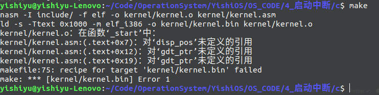
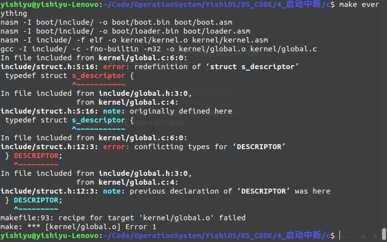
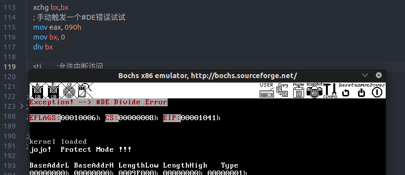
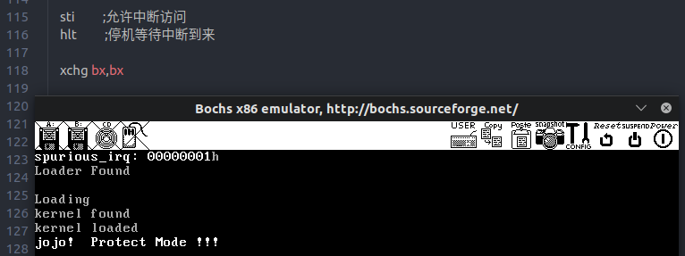

# 启动中断

在 a 版本中仅进行文件夹的整理和 makefile 的规范化,没有添加其他代码

> boot 引导扇区和 loader 的所有代码  
> kernel 内核源文件  
> include 内核头文件  
> lib 模块/功能/函数文件

在 b 版本中修改了之前的一个函数,毕竟在内存中给 kernel.bin 留下的空间超过了 60kb  
loader.asm 中的 load_file 函数: 最大支持 12kb 文件的加载 ==> 支持任意大文件的加载  
修改后的 load_file 最大支持 268 kb 文件的加载

在 c 版本中开始启动中断机制

文件结构:

|                   文件                    |                 作用                  |
| :---------------------------------------: | :-----------------------------------: |
|            /kernel/kernel.asm             |               内核入口                |
|             /kernel/kernel.c              |         仅在内核中用到的函数          |
|             /kernel/global.c              | 使得在汇编的时候 kernel 能使用 c 语言 |
|              /include/type.h              |             数据类型定义              |
|             /include/struct.h             |              结构体定义               |
|             /include/macro.h              |                宏定义                 |
|             /include/global.h             |              变量的定义               |
|   /include/memory.h </br> /lib/memory.c   |            内存操作的函数             |
| /include/display.h </br> /lib/display.asm |           字符界面显示函数            |
|    /include/port.h </br> /lib/port.asm    |             端口操作函数              |

## 1. 切换堆栈和 GDT

遇到一个问题, 已经添加了 extern 关键字,但是仍然在汇编中无法使用 c 中定义的变量  
本来以为是没有 global.c 的原因,结果不是

接着发现报错的并不是 nasm 而是 ld. 也就是说错误是出现在链接阶段



结果有两个

1. 确实是没有 global.c 导致链接器不知道定义的变量在哪里
2. 定义了之后没有修改 makefile...

需要注意 gcc 需要增加-m32 选项,显示指明生成文件为 32 位

遇到了一个把同一个头文件包含两次引起的结构体重复定义的错误  
重新整理 global.c 后通过



本来想一步步添加功能函数,先把中断打开跑起来再说,结果真的是拔出萝卜带出泥...

终于明白了之前一直不明白的 c++中的防止重复 include 的宏的作用了  
这个简直太重要了艹,否则弄到吐血也理不清包含关系(甚至可能相互依赖?)  
马上给所有的头文件都加上这个宏...这下随便怎么相互引用都不会重复定义了

```c++
#ifndef xxx
#define xxx
#endif
```

编译的时候出现错误:

```text
对‘__stack_chk_fail_local’未定义的引用
```

发生的原因是 gcc 对堆栈的一些保护什么的  
在 GCC 的标志里面加上-fno-stack-protector 即可  
不过这也说明终于到了最后一步了!!!

在 bochsrc 中添加如下语句打开键盘

```text
keyboard: keymap=/usr/share/bochs/keymaps/x11-pc-us.map
```




