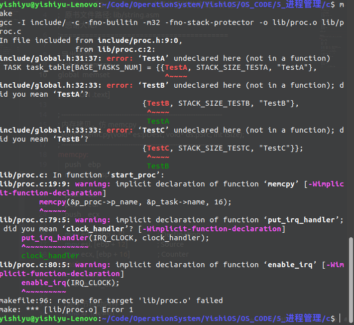

# 进程管理

在开始之前发现一个有意思的东西

进行如下操作之后 b 文件夹中的内容是修改后的 a 文件夹

> 1. a 文件夹被点击复制
> 2. a 文件夹中的文件被修改
> 3. a 文件夹被粘贴为 b 文件夹

## 基本安排

1. 加载 TSS(DONE)
2. 初始化系统基本进程

需要注意的部分:

> 1. 随意添加新进程要等文件系统和主存管理两部分完成后才能实现
> 2. 将来要实现微内核架构,在这之前如果要使用某些系统调用,先用宏内核的方式实现,后面再用微内核的方式重写
> 3. 在这一章需要完成进程调度, 时钟中断处理

## TSS

第一个重要内容就是 TSS 的生命流程  
TSS 只有一个,存放在内核代码的 TSS 段中  
每个程序控制块中只有自己的堆栈和状态寄存器等信息

所有程序公用一个 TSS 段,也就是说公用一个内核栈  
Intel CPU 原本的设计是通过切换 TSS 寄存器来切换任务,每个进程内部都有一个 TSS  
但是切换 TSS 是很耗费时间的,公用一个 TSS 段可以提高运行速度,linux 采用的就是这种方法

参考资料: [进程切换与TSS](https://blog.csdn.net/nodeathphoenix/article/details/39269997)

## 初始化系统基本进程

系统基本进程其实是测试用的进程,在后面会改成 tty 进程和 gui 进程等系统进程  
初始化系统基本进程和进程调度放在 proc.c 文件中

kernel.c 的日渐膨胀....  
头秃...

再划分一个文件来存放 kernel.c 中用到的二级函数  
再划分一个文件来存放进程管理相关内容

|                   文件                    |                 作用                  |
| :---------------------------------------: | :-----------------------------------: |
|            /kernel/kernel.asm             |               内核入口                |
|             /kernel/kernel.c              |          在内核中用到的函数           |
|             /kernel/global.c              | 使得在汇编的时候 kernel 能使用 c 语言 |
|            /include/kernel.inc            |         kernel.asm 中的宏定义         |
|              /include/type.h              |             数据类型定义              |
|             /include/struct.h             |              结构体定义               |
|             /include/macro.h              |                宏定义                 |
|             /include/global.h             |              变量的定义               |
|   /include/memory.h   /lib/memory.c   |            内存操作的函数             |
| /include/display.h   /lib/display.asm |           字符界面显示函数            |
|    /include/port.h   /lib/port.asm    |             端口操作函数              |
|    /include/func.h   /lib/func.asm    |       kernel.c 中用到的二级函数       |
|        /include/proc.h /lib/proc.c        |           进程调度相关内容            |
|  /include/irqhandler.h /lib/irqhandler.c  |           中断处理相关内容            |

## 2. 初始化系统基本进程

头文件循环引用问题

> 如果一个头文件被主程序通过多种路径引用了多次,可以通过加宏定义来解决  
> 但是如果引用图形成了环那就糟糕了....  
> 大佬们给出了解决方案,但是最简单有效的就是重新设计文件引用关系...  
> c 版本出现了头文件循环引用的情况...(global.h 和 proc.h 相互依赖)  
> 所以 c 版本暂且搁置,d 版本重新设计文件引用关系  
> 啊算了先用一个单独的文件存放具体进程函数,后面再说

接着又遇到了变量重复定义的问题,但是头文件都加上了预编译宏  
变量不能在头文件中声明,需要在 c 文件中声,然后在 h 文件中使用 extern 关键字导入  
有的变量没有出错,管他呢,哪些变量出错了就按照上述方式办

解决方案: [C++将一个cpp文件中的变量应用到另一个cpp文件中](https://blog.csdn.net/qq_27942333/article/details/84719737)
