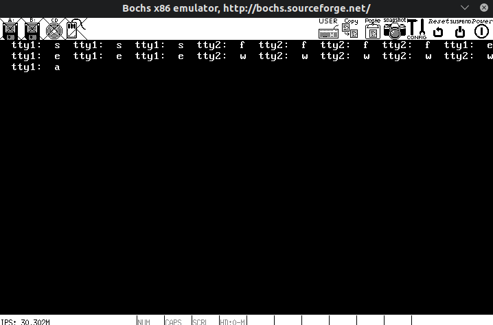
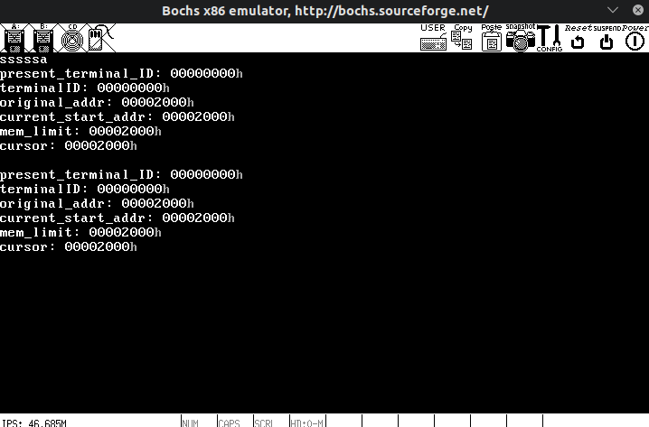

# 输入输出系统

## 1. 重新整理文件夹

感觉有必要重新整理一下文件夹了,include 中有太多文件了,寻找文件变得非常不方便  
同时不同文件中的内容分配也有些混乱,容易引起循环引用等乱七八糟的问题

所以 a 版本重点在于重新整理文件夹

首先整理出当前文件的相互依赖关系

依次看了几个整理依赖关系的软件

1. CodeViz 好像对 gcc 版本有一定要求
2. calltree 仅能整理函数调用关系
3. cflow 仅能整理函数调用关系

相关介绍:  
[静态分析 C 语言生成函数调用关系的利器——cflow](https://blog.csdn.net/breaksoftware/article/details/75576878)  
[cflow 官方网站](http://www.gnu.org/software/cflow/)

配合 makefile 的参数,可以对任意文件分析其函数调用呢关系

同时 gcc 也可以用来生成 c 文件的依赖关系  
[利用 GCC 生成 c 文件依赖关系](https://blog.csdn.net/mycourage1/article/details/7098250)

算了先把文件夹整理一下算了

|      文件夹      |     文件     |            作用            |
| :--------------: | :----------: | :------------------------: |
|   include/base   |   macro.h    |           宏定义           |
|                  |    type.h    |      基本数据类型定义      |
|                  |   struch.h   |         结构体定义         |
|                  |    port.h    |        端口操作函数        |
|                  |   memory.h   |        内存操作函数        |
|                  |  kernel.asm  | 内核汇编文件中用到的宏定义 |
|                  |    func.h    |      系统中的基本函数      |
|                  |   global.h   |        全局变量声明        |
| include/display  |  display.h   |      字符界面显示函数      |
| include/interupt | irqhandler.h |      中断处理函数定义      |
|                  |  initirq.h   |    初始化自己的中断程序    |
| include/process  | kerneltask.h |        内核进程定义        |
|                  |    proc.h    |       初始化内核进程       |
|      kernel      |   global.c   |        全局变量定义        |
|                  |  kernel.asm  |          内核入口          |
|                  |   kernel.c   |  内核中会用到的函数的定义  |

## 2. 键盘输入

用户界面进程为系统初始进程,包括两种--GUI 桌面,CLI 命令行  
用户界面初始数量一定,不可新建也不可销毁

每个系统初始进程都有一个键盘缓冲区,在进行进程调度的时候,切换键盘输入缓冲区为不同初始进程的键盘缓冲区

不同用户界面中的程序通过访问用户界面的公共键盘缓冲区来获得键盘输入  
在键盘中断处理中添加特殊的键值用来切换用户界面

GUI 界面中有自己的图形界面缓冲区,大小为 64Kb

最近思路有点乱了,先看看别人写的再说

破案了, 想要设置显卡的显示模式好像只能在实模式下通过设置显卡模式的中断完成

重新整理一下思路, 这个版本只做命令行界面, 做好了之后再尝试图形界面

做完输入输出系统还有进程间通信, 文件系统, 内存管理三部分

同时系统结构综合采用宏内核和微内核

部分系统函数采用宏内核完成,如读取键盘等

部分系统功能采用微内核完成,如申请内存,读取文件系统

暂时不实现软中断功能,不支持随意新建终端

|      文件夹      |     文件     |            作用            |
| :--------------: | :----------: | :------------------------: |
|   include/base   |   macro.h    |           宏定义           |
|                  |    type.h    |      基本数据类型定义      |
|                  |   struch.h   |         结构体定义         |
|                  |    port.h    |        端口操作函数        |
|                  |   memory.h   |        内存操作函数        |
|                  |  kernel.asm  | 内核汇编文件中用到的宏定义 |
|                  |    func.h    |      系统中的基本函数      |
|                  |   global.h   |        全局变量声明        |
| include/display  |  display.h   |      字符界面显示函数      |
| include/interupt | irqhandler.h |      中断处理函数定义      |
|                  |  initirq.h   |    初始化自己的中断程序    |
| include/process  | kerneltask.h |        内核进程定义        |
|                  |    proc.h    |       初始化内核进程       |
|      kernel      |   global.c   |        全局变量定义        |
|                  |  kernel.asm  |          内核入口          |
|                  |   kernel.c   |  内核中会用到的函数的定义  |
| include/syscall  |  syscall.h   |          系统调用          |

其中读取键盘系统调用返回的是一个结构体,由一个类型码和一个数据成员组成

| 变量 |   类型    |        意义        |
| :--: | :-------: | :----------------: |
| type | key_type  | 指明数据成员的类型 |
| data | key_value | 指令数据成员的数据 |

原本的想法:  
系统调用部分不使用 int 产生中断信号,直接通过函数调用,然后和中断处理一样进行屏蔽中断,切换栈空间等操作  
也就是说不走中断的形式,但做和中断一样的工作  
仔细想了想,这样的话会影响栈的切换,用户程序大部分都不会有足够的优先级来切换到内核堆栈和使用关闭中断的指令  
所以还是使用普通中断来实现系统调用吧(linux 使用的是 0x80 号中断指向系统调用)

键盘输入基本完成了,但是存在一点问题,对于 make code 为多个字节的情况,读取中断可能发生在两次键盘中断之间,这个时候就读取两个奇怪的内容.  
解决方法: 给键盘缓冲区加一个非空标志位,在读取键盘之前检查非空标志位,在写入缓冲区时,如果写入的是 E0 码,则非空标志位不变,否则变为非空标志(虽然这样也会有一点问题,就是如果本来非空的,此时写入一个 E0 码,还是可能读取在两次键盘中断之间)  
更好的解决方法是建立一个和缓冲区同样大的标志位缓冲区,为每一个缓冲码都建立一个标志位  
采用第二种解决方法(d 版本已完成)

后面用一个系统进程专门处理键盘信息,如果触发系统热键则直接完成操作(如切换 TTY 等),键盘处理进程完成对键盘信息的加工和处理,储存在键盘信息结构体缓冲区中,e 版本把这一部分完成(系统进程也有自己独立的栈空间,不会影响内核栈)

为此在 include/process 和 lib/process 中分别建立 kerboardserver 和 terminal 两个文件夹,用来存放两个系统进程相关内容,kernaltask.h 依然进行汇总,但是取消 kerneltask.c 文件  
同时把处理键盘在一个单独任务级进程中完成,可以减少读取键盘中断所用的时间

发现一个有趣的东西,之前的好几个版本的读取键盘居然都没有通过中断,而是直接调用的对应的函数...其实改一个函数名就好了(通过另一个函数间接调用最终函数)

至此,键盘输入基本已经完整地实现了,后续的系统热键也可以通过在对键盘译码的时候直接由系统级任务完成

## 3. 屏幕输出

其实 Orange 中的结构体加函数指针本身就是面向对象的做法

在中断任务函数中公用一些子函数,但是有自己私有的变量,这种做法其实和类是一样的  
不过混合使用 c 和 c++有很多麻烦的事,现在为了不蹚这个浑水先用结构体+函数指针来完成这个任务
[如何混合 C 和 C + +编程](http://www.sunistudio.com/cppfaq/mixing-c-and-cpp.html)  
[C++项目中的 extern "C" {}](https://zhuanlan.zhihu.com/p/79480033)

有个奇怪的点,Orange 里喜欢用结构体指针代替结构体变量,虽然除了访问成员方式不同以外并不知道有什么不同,先埋个伏笔

本来想把终端任务弄成和键盘处理任务一样的多个独立任务,但是突然发现如果这样的话,处理多个终端之间的切换会有点麻烦,Orange 单独弄一个终端任务列表

最终的设计如下:

> 1. 在就绪队列中,维护一个常存的终端进程指针
> 2. 单独设立一个终端队列,就绪队列中的终端进程指针指向其中一个成员
> 3. 终端结构体中存放两个变量--> 当前终端 flag 执行中 flag
> 4. 如果触发终端切换,则修改终端进程指针指向的终端队列成员
> 5. 如果触发时钟中断,首先轮换就绪队列中的任务,其次轮换终端队列中的成员
> 6. 时钟中断根据终端是否为当前终端和是否执行中分配不同的时间,以做到终端后台执行(多进程)

刚开始想的时候有一个地方想错了,就绪队列不是指针数组...而是结构体数组...  
这样的话只能同时维护两个队列,一个普通任务队列,一个终端队列,修改时钟终端分别对其进行处理,同时用一个指针指向当前终端(这么做的话倒是切换终端更方便)

使用键盘服务器处理终端切换的时候触发了#GP(general protection),原因是任务级进程试图调用内核级函数...  
解决方法是把键盘服务器改成内核级...

发现只要不调用内核函数,其实是可以修改变量的,也就是可以实现切换终端,那就不用 切换到内核级了(其实是想这么做然后失败了哈哈哈哈)

终于做到了切换多个 tty,虽然 tty 很简陋,下面开始整理完整的终端框架(f 版本实现多个终端切换)

其实 Orange 也是用一个独立于任何终端的程序处理键盘输入的,也就是 in_process 函数

突然发现一个问题,这么切换的话是无法切换 PCB 之类的...  
到目前为止好多地方做得简直吐了,包括之前的键盘处理进程,本意是为了减少系统调用和中断的处理时间,但是这么做反而花了更多的时间,何必呢...简直是提前优化的典型

这里修改为所有终端同时运行,把原本的当前运行终端指针更换为当前桌面终端下标,当且仅当一个终端运行在当前桌面的时候才读取键盘,同时在从后台切换为桌面时刷新屏幕

这个终端的结构体不知道什么时候里面的变量被改了...导致切换到第二个终端后无法切换回第一个终端  
经过一系列的排查,应该是第二个终端在初始化的时候发生了一些问题,导致第一个终端结构体里的数据被改了(在阻止第二个终端初始化后问题得到解决)

问题出在 terminal_init()函数中,在初始化第二个终端的结构体的时候,第一个结构体也被改变了...头秃

产生这个问题的原因是之前抄了 Orange 中终端结构体定义里的控制台指针,但是这个指针并没有分配空间给结构体,导致两个终端结构体里的控制台指针都没有初始化且指向相同的内容,公用相同的空间(这个空间很可能是 0x000...也就是 BIOS 中断区域...)真的是失了智了....解决办法就是把结构体指针改成结构体就行了...

明天重现写一遍终端里用到的打印函数等就可以了,终端就基本完成了

如果用 gdb 调试的话可能能更早发现这个问题的原因,不过应该有点麻烦,回头转用 VWare 的时候再好好整整 gbd 远程调试

终端显示的方式思路如下:

> 1. 终端显示不会自动翻页,需要使用上下功能键来翻页(逐行)
> 2. 终端只有替换模式没有插入模式(太麻烦了...)
> 3. 翻页到最低行的时候无法继续向下翻页,最顶无法向上翻页同理
> 4. 提供 clear 命令用来清理屏幕(清楚终端所有显存)

其中输出函数 printf()对于用户程序来说,需要用系统调用来实现  
但是终端程序本身就是任务级进程,可以直接操作显存,所以采用更简单的方式来实现,等以后有需要的时候再用系统调用来实现

遇到一个小问题,C 函数中只有 0 被识别为 False,其余为 True

继续添加像 dos 一样的提示符,在 i 版本中添加方向键的函数

同时终于想到了终端结构体里的 count 这个变量能干啥了哈哈哈哈,可以用来记录命令到达过的最大位置,也就是在光标左右移动的时候可以记录光标的左右界限,也负责在执行命令的时候正确找到完整的命令(执行命令的时候取命令按照 count 来确定命令的长度,而不是头尾指针)

输入输出系统终于完成了(指终端系统),撒花,虽然关于终端的系统调用函数并没有完成哈哈哈哈
