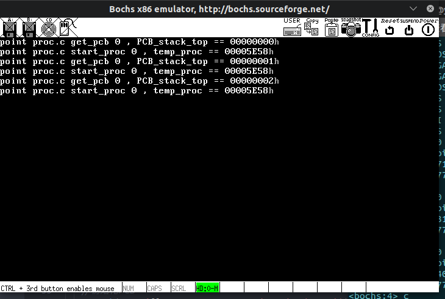
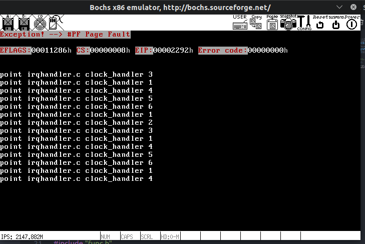
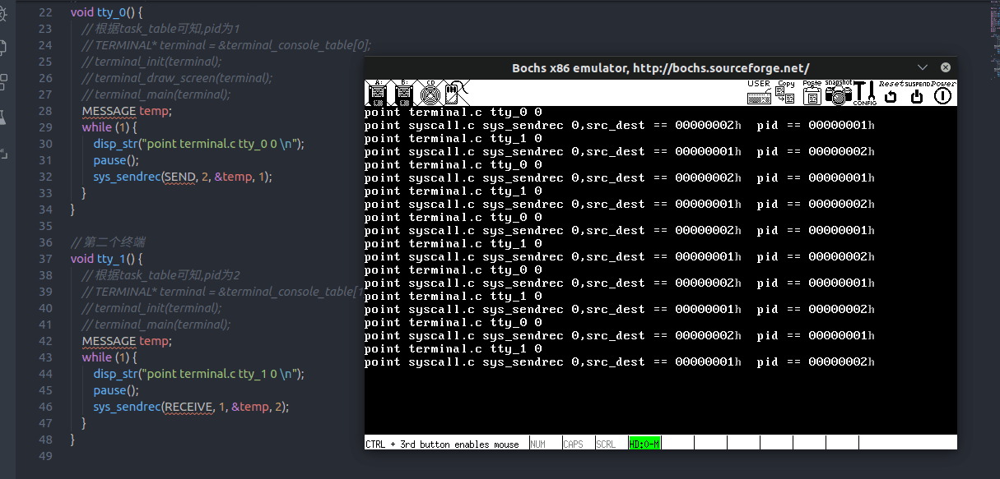
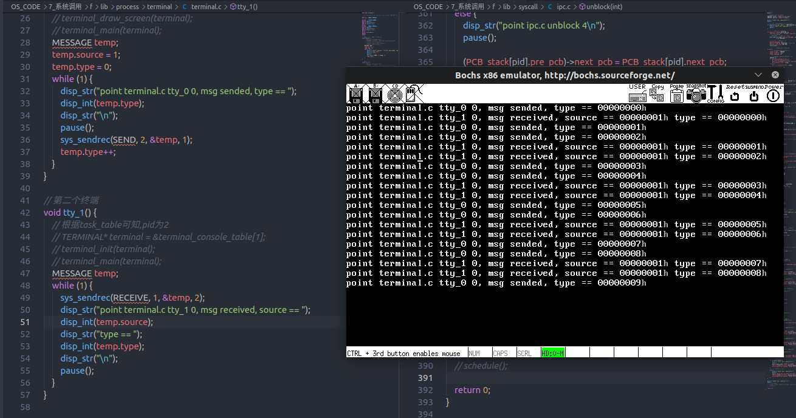

# 系统调用

## 概述

原本这一部分名字是进程间通信,但是进程间通信本身比其他部分容易实现得多,同时还有很多其他的系统调用没有实现,所以这一部分同时把其他部分的系统调用也完成了

主要要实现的功能有:

> 1. 终端输出系统调用(用于以后写的其他用户程序可以输出到终端)(系统调用相关)
> 2. 完备的进程阻塞,挂起,唤醒操作(系统调用和进程管理相关)
> 3. 进程间通信机制(系统调用相关)
> 4. 添加获取时间系统调用(通过进程间通信实现)
> 5. 修改键盘读取调用

## 1. 终端输出系统调用

这个以后可能会有用,先实现这个

首先把之前的代码改一下,每个终端进程一个的终端结构体改为全局变量中的一个表,每个终端持有一个指向其中一个成员的指针  
这么做的原因是以后就可以只用终端结构体代号就可以操作相关终端了,而不必传终端结构体指针了

为此,原本放在 terminallib.h 的结构体定义需要放在 struct.h,防止循环引用

添加系统调用的步骤:

> 1. 修改 SYS_CALL_NUM
> 2. 修改 sys_call_table[]
> 3. 在 syscall.h 和 syscall.c 中添加处理函数

<!--  记错了,这些是硬件中断的> 3. 在 irqhandler.h 和 irqhandler.c 中添加中断处理函数
> 4. 在 initirq.c 中的 init_IRQ()函数中初始化添加的中断并启动其 -->

终端输出系统调用本身函数体很简单,其他功能(如实现格式化字符串在用户态由相关函数完成)
简单而言就是获取两个参数,一个是终端号,一个是字符指针,指向字符串中第一个字符  
终端执行任务的时候创建一个新进程,同时把自己的终端号作为初始参数之一传进去,该进程在向终端打印东西的时候需要把终端号传给系统调用函数

a 版本基本成功实现了中断输出系统调用,关于把数字转成字符这种工作留在用户空间完成就好了

## 2. 完善进程调度(添加进程的阻塞和唤醒操作)

彻底重新实现进程调度,维护三个队列:

- 就绪队列(准备就绪,准备执行)
- 阻塞队列(等待消息或等待资源)
- 挂起队列(等待 CPU 时间片)

其中,就绪队列中的进程在时间片耗尽之后进入挂起队列  
就绪队列中的进程全部进入挂起队列之后,重新为挂起队列中的进程恢复时间片,然后将其转化为就绪队列  
进程可以主动挂起,进入阻塞队列,阻塞队列中的进程不会主动回到就绪队列,需要其他条件触发  
其中阻塞队列是为了配合后续的进程间通信机制

就绪队列和挂起队列可以相互转换,且恒 FIFO,故都采用链表队列

阻塞队列需要随机恢复,随机插入,最好是用哈希表存放,但是现在为了这个写个哈希太小题大做了,所以和前面保持一直,依然采用单向链表的形式

修改顺序为

> 1. 在 global.h 和 global.c 中建立相关数据结构
> 2. 在 proc.c 中修改进程初始化函数
> 3. 修改时钟中断处理函数(进程调度函数)

同时由于现在系统是无法获取新内存的,所以新建足够多的进程链表节点,采用栈的形式来获取新的进程链表节点

三个链表都使用头尾指针,其中尾指针指向最后一个节点,用于添加新的节点

关于新的进程链表节点,直接在原基础上加一个指向自身结构体的指针即可  
就绪队列的头指针就是著名的 p_proc_ready 哈哈哈哈

回头想想如果头尾都是指着的话,就没有头结点了.这个后面会有乱七八糟的麻烦,所以把 PCB 改为双向链表节点,而尾指针改为一个空节点

proc.c 中的初始化函数有点过于臃肿了,分离出一个单独函数,用于根据一个预定义任务表初始化一个任务级 pcb 块

改进预定义任务结构体,添加成员--优先级

b 版本把数据结构搭好了,还差初始化函数和中断处理函数  
留给明天的 c 版本

同时在全局变量中也把终端进程和其他任务级进程合并在一个数组里

实现进程调度有两种方法

- 每次时钟调度都寻找就绪队列中最高优先级的任务
- 在把挂起队列转化为就绪队列的时候,进行一次排序,在进行调度的时候直接取当前 pcb 节点指向的下一个 节点即可

毫无疑问第二种方法更优雅,采用第二种方法

毫无意外地发生了 BUG,但是这个好像是随机出现的,在时钟中断处理加入断点,有的时候经过了断点才发生#GP 错误,有的时候不经过断点就直接发生了

为了能在 c 语言中获取到调试信息,增加了一个调试标志宏,然后就可以随意在内核中使用打印函数输出相关信息了

注意到一个问题,有时候触发#GP 错误的时候,光标依然停在没有初始化屏幕的位置,应该死调度的时候发生了错误,经过测试,应该是进行第一次进程切换之后发生了错误,即新的执行中进程指针发生错误  
也就是初始化的时候,就绪链表出错了

果然,发现 get_pcb()函数返回的结构体地址是相同的,整明白了,不能通过这种方法获取新的 PCB 块



再次出现 BUG,从图中触发断点的规律结合断点位置看,就绪队列中的元素越来越少???  
说明进程调度函数中发生了丢进程的现象...



c 中重新用链表队列实现了进程调度,时钟中断负责处理进程的挂起与恢复,着实有点繁琐,d 版本中实现进程的自我挂起

有一个棘手的问题,未来终端肯定是需要能创建新任务的(即新进程),可能需要挂起自己,但是这样的话如,切换终端可能就需要新进程来操作了(可以创建一个新系统调用)

预想中未来的终端

> 1. 可以新建终端
> 2. 可以新建其他进程,以自身为输出屏幕,阻塞自己,同时所有自身职责交给新进程
> 3. 除了最初的终端以外,可以终结自身
> 4. 全员为任务级进程 ,可以使用系统调用和系统内核函数

预想中未来的用户进程

> 1. 由终端新建
> 2. 需要完成一部分原本终端的任务(如响应切换终端,刷新屏幕)
> 3. 可以终结自身,此时唤醒原终端,控制权移交原终端
> 4. 为用户级进程 ,可以使用系统调用

## 3. 进程间通信机制

由于进程的挂起与唤醒和进程间通信密不可分,所以必须一块儿实现,从 d 版本开始做

回忆一波系统调用添加方法

> 1. 修改 SYS_CALL_NUM
> 2. 修改 sys_call_table[]
> 3. 在 syscall.h 和 syscall.c 中添加处理函数

首先,现在的进程间通信主要是为实现其他系统调用服务,两个用户进程之间通信暂时不需要考虑

所以暂时不实现端口那种高级的进程间通信,而是实现基于确定的进程号的进程间通信(把服务器的进程固定可以方便实现 FS 和 MM 等功能)

重新修改申请空白的 PCB 的机制(因为栈的话肯定不能随机分配和回收)  
理想的机制如下:

> 1. 维护一个 PCB 列表和一个标志位列表
> 2. 分配时,分配第一个空 PCB,同时把其下标作为进程号
> 3. 回收时直接把其 PCB 恢复为未使用状态即可  
>    这么做的好处是在进程间通信的时候,进程号可以作为寻找进程 PCB 的下标

总体来看,采用同步的方式实现进程间通信,参考 Orange 的弄  
本来觉得 Orange 中直接把进程 PCB 附在发送对象进程 PCB 中的一个指针上太粗暴了,但是后来想想还是有道理的,理由如下:

> 1. 所有的操作都是在内核态中的,由我们掌控,不用担心安全问题
> 2. 接收方可以很方便地操作发送方,把其唤醒等,也可以很容易地获得其信息

好了基本把大概方向搞清楚了,明天开始做

首先在 e 版本中修改 get_pcb()这个函数,详见 proc.c,使得可以随机存取空 pcb,且使 pid 永远唯一且与进程下标对应

发现之前弄那个调试宏有点逻辑混乱...重新在几个文件里调整了一下  
proc.h irqhandler.h syscall.h macro.h

添加进程间通信后需要修改时钟处理中断,因为在阻塞一个进程 之后可能直接导致就绪队列为空,这在之前是不会出现的  
使得时钟处理函数能处理空就绪列表,然后把其分离出来作为一个单独函数,共享给进程间通信使用

关于阻塞进程部分,有三个方法:

- 在 IPC 的过程中直接阻塞(把进程放进 wait 队列)(YishiOS 方法)
- 在 IPC 的过程中在 PCB 里设置标志,在下一次时钟中断的时候进行阻塞
- 不强制阻塞,仅设置一个标志,在时钟中断中根据标志判断该进程时候可以运行(Orange 方法)

<!-- 本来想着在IPC中直接阻塞是不是会造成一些麻烦,但是仔细想想,也只有这种方法能保证用户进程在执行完IPC系统调用的下一句就可以保证目标进程收到了信息   -->

之前的想法有点问题,如果在 IPC 中执行进程调度的话,返回值是会返回给另一个进程的,而原进程不会收到任何返回值(系统调用返回值妨碍 eax 中),这么一来会出现两个现象

- 原进程的系统调用没有收到返回值(eax 的值保持不变,依然为原系统调用号)
- 新进程运行过程中 eax 寄存器突然发生改变...

解决办法有是有,不过有点丑陋...

> 设置一个特殊数字,在 IPC 系统调用返回的时候,判断返回值是不是该数字  
> 如果是此数字,说明发生了 IPC 内进程调度,不修改 eax 以保护数据  
> 保证 IPC 系统调用号非 0,如果正确返回,则将返回值设为 0  
> (这么一来,调用者根据返回结果是否为 0 就可以得知 IPC 过程中本进程是否被阻塞了)  
> 两个现象中第二个现象破坏性更大,这么做就可以避免了

啊最新消息,这个不用管了,可以放心地在 IPC 中进行进程调度了

```asm
sys_call:
    call    save
    sti

    push    esi
    push    dword [p_proc_ready_head]
    push    edx
    push    ecx
    push    ebx
    call    [sys_call_table + eax * 4]
    add     esp, 4*4

    pop    esi
    ; ; 如果是IPC系统调用,则需要注意返回的时候是否对原进程进行了阻塞
    ; ; 如果对原进程进行了阻塞,则需要注意不能修改eax,否则会对新进程造成破坏
    ; 啊当上面的东西没说,卧槽于渊大佬太秀了这个
    ; 这个esi埋伏了一手,如果发生了上述情况,修改的eax是原进程的,转入的是新进程,互不相关
    mov     [esi+EAXREG - P_STACKBASE], eax
    cli
    ret
```

为了方便调试,修改 dispstr 函数,使得该函数在第一屏上循环打印

如果把那个调试宏放在头文件中,会对 include 其的所有文件产生作用,改进为放在 c 文件中

系统调用是通过寄存器传参的,原本只能传三个  
再加上 edi 寄存器,最多传 4 个参数(esi 在系统调用中有重要作用,不能瞎改)

e 版本基本把 IPC 机制完成,可能有一点 bug,不过基本完成了,后面遇到问题再改



同时发现一个终端打印系统调用的 bug,没有进行参数的偏移地址到线性地址的转换

留给 f 版本完成

f 版本首先把终端打印系统调用的 bug 修复了,方法就是和 ipc.c 中一样把局部地址转化为内核地址  
首先把那几个公用的函数放到 syscalllib.c 中,然后在 syscall.c 中的相关函数中添加修改语句

有一个问题,终端打印系统调用本身是没有把进程号传进去的,修改一下  
同时把所有中间的 asm\_\*\*\*函数统一起来,改为 asm_syscall(int sys_vector, u32 para0,u32 para1,u32 para2, u32 para3);

f 版本再对 IPC 机制进行最后的调试(对传输的数据的正确性进行一下验证)

验证结果如下,基本正确,这种情况恰巧说明运行完全正常,理由如下:

> 1. 第一次运行,AB 进程都处于运行状态,A 发送信息后阻塞 A
> 2. B 接收到信息,显示信息,继续接收,唤醒 A,阻塞自身 B
> 3. A 发送信息,唤醒 B,继续发送信息,发现 B 为运行状态,发送信息,继续发送信息,阻塞自身 A
> 4. B 接收信息,唤醒 A,显示信息,继续接收,发现还有信息,继续接收并显示,继续接收,阻塞自身 B



## 4. 添加获取时间系统调用

g 版本添加这个系统调用,其实感觉用直接的系统调用实现起来更好  
就用直接的系统调用实现吧

再复习一遍

> 1. 修改 SYS_CALL_NUM
> 2. 修改 sys_call_table[]
> 3. 在 syscall.h 和 syscall.c 中添加处理函数

## 5. 修改键盘读取调用

<!-- 为什么要做这个呢,因为异步地通过系统调用读取键盘太捞了...
原本的读取一个键盘需要三步,首先键盘触发中断,存放在键盘缓冲区中,再有键盘服务器进程译码,最后由最终的进程通过系统调用

不过也不亏,之前的摸索基本摸清了添加系统调用的方法

后面理想的键盘处理如下:
> 1. 首先一切行为都基于终端(后面弄桌面版本的时候再弄)
> 2. 键盘触发中断后,通知键盘服务器进行处理
> 3. 终端随时运行,即是调用了新的进程也依然运行
> 4. 终端在读取键盘之前处于等待中断状态,在接收到 -->

<!-- 原本想参照 linux 重新用同步的方式实现一下读取键盘的操作,但是越搞越复杂(其实是懒得弄了...),所以还是按照现在的思路继续用异步的方法实现吧

用不严格的方式限制进程的读取操作,虽然这样来弄肯定会浪费一些性能
如果终端创建了新进程,则新进程应该也采用类似的方法来操作

同时用进程自己主动进入挂起队列可以减少一部分性能浪费,因为如果一个进程如果在等待读取键盘,如果读取结果为空,在运行键盘服务器之前的结果肯定也一直为空,所以主动挂起可以有效减少时间浪费

所以这一部分改为实现主动挂起的系统调用

然后把键盘服务器改成像 Orange 处理硬盘的进程一样的形式 -->

啊算了,直接把译码工作放在中断中,然后把键盘服务器改为类似 linux input 子系统一样的东西,负责冒泡向上传递底层事件,详细处理如下:

键盘中断处理如下:

> 1. 键盘中断发生的时候完成所有译码工作
> 2. 键盘处理程序发送事件信号给 input 子系统

input 子系统设计如下:

> 1. 本身是一个进程,处于等待消息的阻塞状态下
> 2. 从信号源接收信息(如键盘中断,未来的鼠标中断,硬盘中断等)
> 3. 普通的中断信息(如普通键盘中断),传递给相关终端(根据全局变量,传递给当前桌面终端)
> 4. 特殊命令中断信息(如切换终端命令),完成处理(如修改全局变量)后传递给终端(需要新终端刷新界面)
> 5. 如果命令有特殊指明目标进程或终端,则把命令传递给相关终端或进程

终端设计修改如下:

> 1. 正常情况下为阻塞状态,等待 input 子系统的消息
> 2. 普通情况下,接收 input 子系统的信息并处理
> 3. 在创建其他进程之后,接收 input 子系统的消息,先预处理,然后向上传递给上层进程

output 子系统设计如下:

> 1. 本身是一个进程,处于等待消息的阻塞状态下
> 2. 接收的消息有两种类型,一种是显示信息,一种是控制信息
> 3. 接受信息后修改显存和相关寄存器

有个问题,如果所有的进程都阻塞了咋弄...

> 1. 设置一个独立于三个队列之外的进程,用专门指针指向,设为空进程
> 2. 进程调度开始,先检查当前进程是否为空进程
>    当前进程非空进程,正常执行进程调度
>    当前进程为空进程,把就绪队列头指针指向就绪队列尾空节点,正常执行进程调度
>
> 3. 进程调度中,如果发现就绪队列和挂起队列全为空,则把就绪队列头指针指向空进程

这些东西有点多,在一个版本内完成有点太多了,单独开辟一个章节来弄这个
