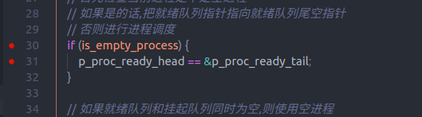

# 调整系统结构

> 1. 空进程
> 2. output 子系统
> 3. input 子系统

## 概述

空进程设计如下:

> 1. 设置一个独立于三个队列之外的进程,用专门指针指向,设为空进程
> 2. 进程调度开始,先检查当前进程是否为空进程
>    当前进程非空进程,正常执行进程调度  
>    当前进程为空进程,把就绪队列头指针指向就绪队列尾空节点,正常执行进程调度
> 3. 进程调度中,如果发现就绪队列和挂起队列全为空,则把就绪队列头指针指向空进程

output 子系统设计如下:

> 1. 本身是一个进程,处于等待消息的阻塞状态下
> 2. 接收的消息有两种类型,一种是显示信息,一种是控制信息
> 3. 接受信息后修改显存和相关寄存器

input 子系统设计如下:

> 1. 本身是一个进程,处于等待消息的阻塞状态下
> 2. 从信号源接收信息(如键盘中断,未来的鼠标中断,硬盘中断等)
> 3. 普通的中断信息(如普通键盘中断),传递给相关终端(根据全局变量,传递给当前桌面终端)
> 4. 特殊命令中断信息(如切换终端命令),完成处理(如修改全局变量)后传递给终端(需要新终端刷新界面)
> 5. 如果命令有特殊指明目标进程或终端,则把命令传递给相关终端或进程

键盘中断处理如下:

> 1. 键盘中断发生的时候完成所有译码工作
> 2. 键盘处理程序发送事件信号给 input 子系统

终端设计修改如下:

> 1. 正常情况下为阻塞状态,等待 input 子系统的消息
> 2. 普通情况下,接收 input 子系统的信息并处理
> 3. 在创建其他进程之后,接收 input 子系统的消息,先预处理,然后向上传递给上层进程

## 1. 空进程

空进程设计如下:

> 1. 设置一个独立于三个队列之外的进程,用专门指针指向,设为空进程
> 2. 进程调度开始,先检查当前进程是否为空进程
>    当前进程非空进程,正常执行进程调度  
>    当前进程为空进程,把就绪队列头指针指向就绪队列尾空节点,正常执行进程调度
> 3. 进程调度中,如果发现就绪队列和挂起队列全为空,则把就绪队列头指针指向空进程

出现一个问题,在进入空进程的时候会卡死  
使用空进程替换一个终端任务,发现正常,也就是说空进程本身及其初始化过程是正常的

又才 pro.c 中修改,使得空进程替换为第一个进程,也没有问题

那么真相只有一个了!!!  
一定是在进程调度的过程 出了岔子  
!!!!!!!!!!!!!!!!!!!!!!!!!!!!!!!!!!!!!!!!!!!!!!!!!!!!!  
问题是这个....被戏耍了.....

啊啊啊用 print 调试实在是太难受了,修改一下,尝试用 gdb+bochs+vscode 来调试

## 2. 重新安装 bochs,使用 gdb 调试

[使用 gdb+bochs 调试](http://bochs.sourceforge.net/doc/docbook/user/debugging-with-gdb.html)

卸载过程:

> 1. 进入当初安装时的源码目录
> 2. sudo make clean
> 3. sudo ./configure
> 4. sudo make
> 5. sudo make uninstall

重新安装过程:

> 1. 进入源码目录
> 2. sudo make clean
> 3. sudo ./configure --enable-gdb-stub --enable-disasm
> 4. sudo make
> 5. sudo make install

在 bochsrc 中开启 gdb
gdbstub: enabled=0, port=1234, text_base=0, data_base=0, bss_base=0

踩个坑,在 sudo ./configure 这一步, --enable-debugger 和--enable-gdb-stub 是互斥的,不能同时使用

在 makefile 中的 CFLAGS,DASM_FLAGS 添加一项: -g

在启动完之后,在 gdb 中使用命令 target remote localhost:1234 与 bochs 连接

1. 第一个问题,生成文件没有符号表

   正确的运行结果如下:

   

   现在的运行结果如下:

   

   BUG 解决办法: gcc nasm 的选项要有-g , ld 的选项中不能有-s

2. 第二个问题,生成的 kernel.bin 文件变得巨大...

   

   预想两个解决方法:

   1. 生成两个版本的 kernel.bin,精简版的在 bochs 中运行,带符号表的在 gdb 中调试
   2. 修改 loader 的位置,保证 kernel.bin 在加载的时候不会影响到运行中的 loader

   本来想用 2 的方法,重新设计了一套内存分配方法,现在感觉影响的东西太多了...  
    先用 1 的方法试一试,编译两套 kernel.bin  
    kernel.bin --> bochs 用无符号表版  
    kernel_gdb.bin --> gdb 用 有符号表版
   成功

3. gdb 与 vscode 的配合
   bochs 调试的过程中 vscode 不断提示"出现异常 SIGNAL 0"  
   这个本质是缺页中断,不会出现危害  
   算了其实问题也不大,出现这个的时候直接点击继续,忽略就行了

缺陷:

> 1. 有时候会出现"出现异常 SIGNAL0",问题不大
> 2. 无法进行汇编级调试,这个问题可以通过再安装另一个不使用 gdb 的 bochs 来解决  
>    关于第二点,以后编写汇编函数的机会很少了,可以暂时不用管了

最终使用方法:

> 1. 在一个单独的终端中使用 make 命令打开 bochs 并完成运行
> 2. 在 vscode 中点击调试即可

## 3. output 子系统

在这一步重新组织输出系统,把输出系统组织成一个单独的进程,其他进程通过通信机制来输出  
重新改写相关的系统调用

output 子系统设计如下:

> 1. 本身是一个进程,处于等待消息的阻塞状态下
> 2. 接收的消息有两种类型,一种是显示信息,一种是控制信息
> 3. 接受信息后修改显存和相关寄存器

需要改动的地方:

> 1. output 进程(任务级进程,本身就处于内核态,可以使用内核的一些东西)
> 2. 增加一种信息类型----输出信息
> 3. 重新改写系统调用
> 4. 重新调整终端进程,改用 output 子系统来进行输出

1. 增加信息类型 ---- 输出信息(DONE)

   > 1. 输出信息类型 ---- 显示信息/控制信息
   > 2. 在 struct.h 中修改相关结构体就行了
   > 3. 在 macro.h 中定义宏定义,指定信息类型

2. 把 console 从终端中分离(DONE)

   > 在 global.c 中设立全局 console 结构体数组,Terminal 结构体中只保留指向 console 结构体的指针
   >
   > 1. 修改 struct.h 中的定义
   > 2. 在 global 中声明相关变量
   > 3. 在终端函数中调整(包括 terminal 初始化过程和输出函数)

3. 添加 output 进程(DONE)

   > 1. 修改 macro.h 中关于进程数的定义
   > 2. 在 process/output/output.c 中编写进程函数体(修改 makefile)
   > 3. 在 global.c 中添加进程的描述
   > 4. 添加处理函数,根据传进去的参数显示内容

4. 修改系统调用,改为使用通信机制实现(原本显示函数和新显示函数共存)(DONE)

   > 1. 消除原本系统调用
   > 2. 修改 sys_write()函数

5. 重新调整终端进程(修改原本显示函数)

   > 1. 修改相关函数  
   >    终端这个就留着吧,每次终端都通过系统调用来打印字符太麻烦了

6. 其他调整(DONE)
   > 为了使得系统进程与相关的 PID 绑定,方便以后实现系统调用等
   >
   > 1. 修改初始进程描述结构体,添加 pid 一项,在 global.c 中修改
   > 2. 在 macro.h 中定义宏定义,绑定系统进程与固定 pid
   > 3. 在 proc.c 中修改  
   >    同时有一个细节是把消息类型的编号和相关系统类型 PID 对应,以后可能有用

## 4. input 子系统

input 子系统设计如下:

> 1. 本身是一个进程,处于等待消息的阻塞状态下
> 2. 从信号源接收信息(如键盘中断,未来的鼠标中断,硬盘中断等)
> 3. 普通的中断信息(如普通键盘中断),传递给相关终端(根据全局变量,传递给当前桌面终端)
> 4. 特殊命令中断信息(如切换终端命令),完成处理(如修改全局变量)后传递给终端(需要新终端刷新界面)
> 5. 如果命令有特殊指明目标进程或终端,则把命令传递给相关终端或进程

需要改动的东西

> 1. 修改原 keyboard server 进程,改为 input 子系统
> 2. 修改中断,改为给 input 子系统发送信息
> 3. 修改终端进程,不断读取键盘修改为等待 input 子系统的消息

1. 创建 input 子系统

   > 1. 创建 input 文件夹,文件,修改 makefile
   > 2. 创建基本函数框架
   > 3. 创建 input 进程

2. 替换 keyboard server

   > 1. 修改键盘中断
   > 2. 修改终端

3. 完全删除 keyboard server
   > 文件夹,makefile,include

发现在 IPC 中会出现的 BUG,由于之前初始化 pcb 的时候没有初始化 ipc 相关的内容,导致 has_int_msg 为补码下限,也就是说会被判定为 True,导致强制接收一个硬件中断信息,后面导致爆炸了  
在 proc.c 中把相关数据全部初始化一遍就好了(flags,has_int_msg

input 处理键盘事务流程:

> 1. 由键盘中断存放键盘码后产生中断通知 input 系统
> 2. input 系统在键盘码缓冲区获取键盘码,注意要首先检查缓冲区中是否有键盘码
> 3. 处理完键盘码,向相关终端发送信息(向最近的一级冒泡)
> 4. 切换终端的任务交给终端,下一级只负责转发,不负责上一级的任务(网络中的分级思想)

再次发现一个键盘中断处理的 BUG,在一开始没有初始化整个键盘缓冲区,导致 key_flag 中并不为 0,而 keyboard server 本身需要根据这个进行判断,导致后面会出错  
在 keyboard.c 中对这个进行初始化(虽然后面整个 keyboard server 都会丢掉,但暂时还需要用)

这么看之前写的好多东西都有问题(也不知道为什么没显现出来)

发现一个问题,input 系统在接收到 alt 键,处理完切换终端,在执行完向 terminal1 发送信息后,原本处于阻塞队列的 terminal0 不见了...

最终发现 bug 产生的原因是,三个进程调度链表的使用不当,有的地方该赋值 pre_pcb 这个指针,图省事给省了...(本来想着除了尾空节点之外不会有地方用到这个前向指针...)  
好在操作这三个链表队列的地方并不多

> 1. 进程初始化
> 2. 进程调度
> 3. 进程的阻塞与恢复

又出现了莫名其妙的 CPU 错误,直接死机了  
查出的结果是在 lock 自身进程之后没有执行进程调度,导致就绪队列头指针指向就绪队列空尾节点  
修改方法为在 lock 函数中执行完 lock 操作后检查就绪队列是否为空,如果为空则执行一次进程调度

d 版本基本完成了上述任务,e 版本把原本的获取键盘的系统调用改一下放在 input 子系统中,然后把键盘服务器相关的东西全删了

e 版本基本顺利,但是之前弄好的空进程又出问题了,莫名其妙设置好的变量变成了空变量

问题出在这里:  

最后把 keyboardserver 文件夹删掉,同时把 keymap.c 一套给弄出来

啊这个结构看起来就好多了

隐患和可以改进的地方

> 1. 整个内核的 MESSAGE 结构体都是静态的,不能动态申请
> 2. 由于 IPC 是同步通信,导致如果有一个终端卡死了,整个 input 子系统都会卡死  
>    从根本上解决这个问题的方法只有把 IPC 改成异步通信(至少发信息的一方不需要阻塞)  
>    同时为了实现异步通信则必须要有动态申请 MESSAGE 结构体的能力(这个可以参考申请空 PCB 的方式来实现)  
>    同时为了实现异步通信,通信机制也需要做不少改动
