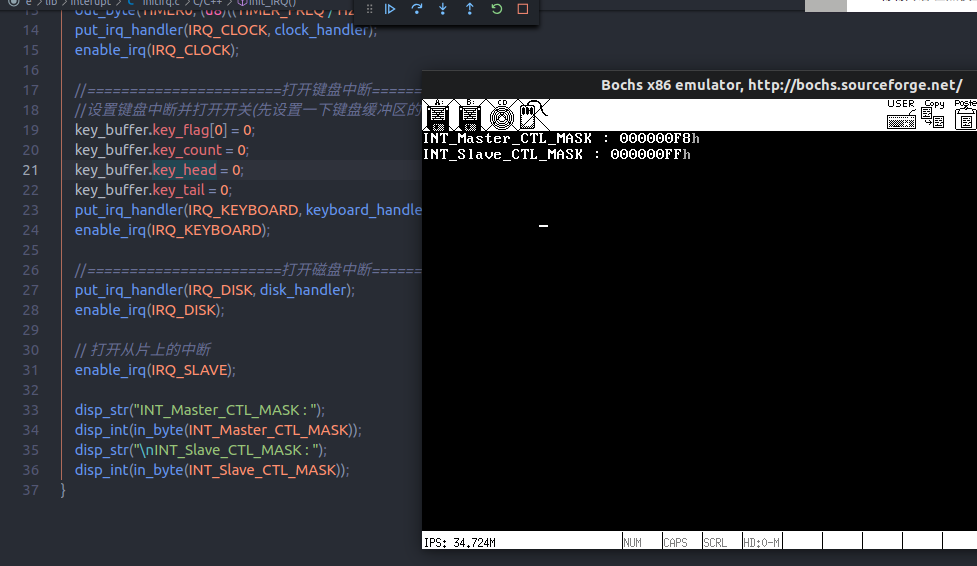
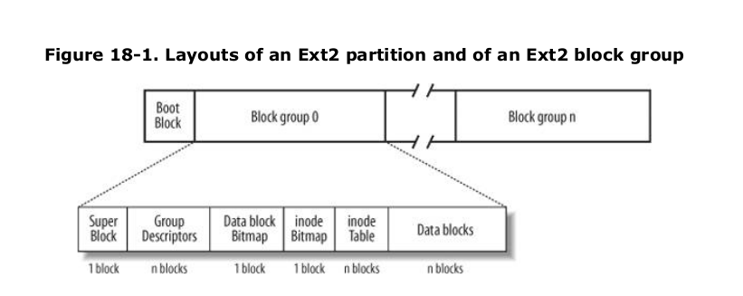
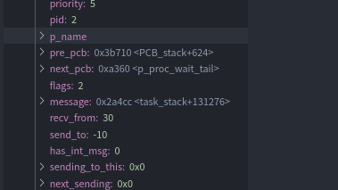
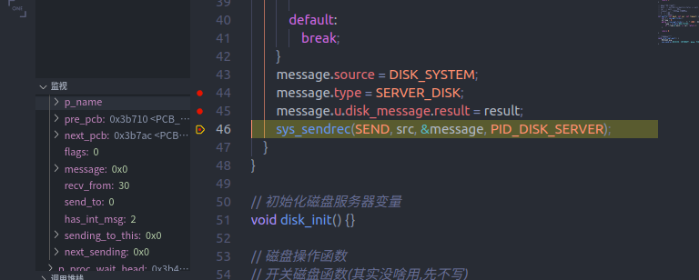
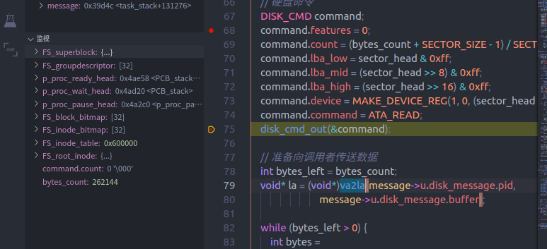
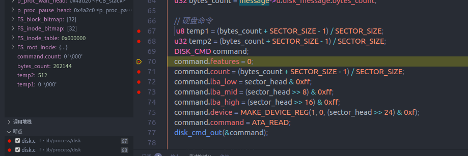
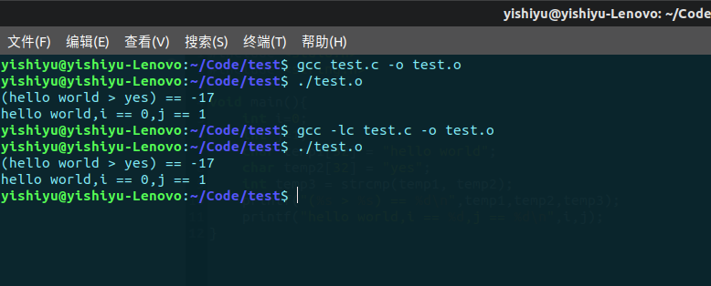

# 文件系统

> 1. 概述
> 2. 硬盘驱动
> 3. ext2 文件系统
> 4. 文件系统框架
> 5. 文件系统功能

## 1. 概述

首先不打算把 YishiOS 和其他操作系统放在同一个硬盘上,太麻烦了  
关于裸机运行的打算如下:

> 1. 把磁盘映像整个格式化为一个文件系统
> 2. 写完所有部分之后测试
> 3. 把 img 文件转为 iso 文件
> 4. 把 iso 文件写入硬盘
> 5. 硬盘启动

## 2. 硬盘驱动

> 1. 硬盘服务进程的基本框架
> 2. 填充并开启磁盘中断
> 3. 填充硬盘服务函数

出现了很棘手的问题, 向硬盘发送命令之后,硬盘迟迟不回送中断  
可能的原因:

1. 中断例程设置错误,没有触发对历程
2. 操作硬盘错误,硬盘没有工作

分别在 disk_cmd_out()前后读取硬盘状态,发现分别是 0x50 和 0x58,根据 orange 334 页不同 bit 的含义得,可能已经完成了读取工作  
尝试注释掉 interupt_wait()函数直接读取,看读到的内容是什么

发现读到的内容和 orange 书上的硬盘信息比较类似,应该是对的  
下一步就是把读到的内容翻译成 ascii 字符串

保存为 b 版本

在 c 版本中首先写一套字符串处理函数(一点一点处理太头大了)  
不重复造轮子了

> [c string lib | github](https://github.com/cloudwu/cstring) (啊这个不太行,这个需要用其他 c 函数...)  
> [字符串操作函数 | csdn 论坛](https://bbs.csdn.net/topics/100107776?list=lz) 暂时先用这个吧...

在 c 版本中转换得到的磁盘信息,完善 disk_info()函数

c 版本完成把获取磁盘信息封装成系统调用  
d 版本开始写其他磁盘函数,好在已经摸清了硬盘驱动的套路的

发现一个大问题,之前硬盘不触发硬盘中断,并不是因为 bochs 硬盘不会触发中断,而是因为中断好像设置错误了  
在 bochsrc 中把 ata0 的中断号改为 6(软盘中断号)后,在 macro.h 中也进行修改,强行启动(反正根本没软盘),这个时候在向硬盘写入数据后触发了 6 号中断

也就是说之前的中断设置有一些问题

先暂时把这一套保存,在 e 版本中修改这个问题

在 e 版本中首先把硬盘中断号改为保留中断号 10 试一试

没有触发中断,也就是说从片上的中断都没有触发  
相关讨论: [使用 8259A 从片上的 irq8 | stack overflow](https://stackoverflow.com/questions/7243683/how-to-enable-irq8-in-my-os-kernel/7245070#7245070)

同时如果全部把硬盘中断号改为软盘中断号,然后取消硬盘驱动中的 wait_interupt(),写读测试通过  
也就是说只要把这个问题弄好了硬盘驱动就完成了

有这几种可能出错原因

> 1. kernel.inc 中的中断处理函数宏弄错了
> 2. 初始化 8259A 从片的过程出错了

发现 kernel.inc 中有一点问题

```asm
    ; 允许8259A接收其他中断
    mov al, EOI
    out INT_MASTER_CTL, al
    nop
    out INT_SLAVE_CTL, al
    nop
    sti
```

改为如下(即先允许从片接收中断,再允许主片接收中断)

```asm
    ; 允许8259A接收其他中断
    mov al, EOI
    out INT_SLAVE_CTL, al
    nop
    out INT_MASTER_CTL, al
    nop
    sti
```

没有起作用

重新检查 8259A 的初始化过程  
和 stack overflow 上的初始化过程对比,初始化没有问题[init 8259A | stack overflow](https://stackoverflow.com/questions/34561275/setting-up-interrupts-in-protected-mode-x86/34565751#34565751)

错误应该出现在初始化的过程中



主片前三个中断都被打开了,分别是时钟,键盘,从片接口  
从片一个中断全部关闭  
结合 enable_irq()函数看,错误出现在从片使能部分

> 修改前: out_byte(INT_Slave_CTL_MASK, in_byte(INT_Slave_CTL_MASK) & ~(1 << irq));  
> 修改后: out_byte(INT_Slave_CTL_MASK, in_byte(INT_Slave_CTL_MASK) & ~(1 << (irq - 8)));

同理修改 disable_irq()函数

```asm
void enable_irq(int irq) {
    if (irq < 8) {
        out_byte(INT_Master_CTL_MASK,
                 in_byte(INT_Master_CTL_MASK) & ~(1 << irq));
    } else {
        out_byte(INT_Slave_CTL_MASK, in_byte(INT_Slave_CTL_MASK) & ~(1 << irq));
    }
}
```

修改后从片设置正常

## 3. ext2 文件系统

> 1. 文件系统进程的基本框架
> 2. 填充具体函数

f 版本开始做文件系统部分,先做个简单的文件系统服务器进程

首先修改 makefile,把编译的中间产物放在 objs 文件夹中,同时在编译完成后不删除中间文件  
这样既可以使得编译后文件夹目录不那么乱,同时不重复编译编译过的文件,加快编译速度

修改 IPC,增加 BOTH 方式(先发送后接收)

参考资料:

> 1. 《深入理解 Linux 内核》第 18 章
> 2. [EXT2 文件系统 | 百度百科](https://baike.baidu.com/item/Ext2/822106?fr=aladdin)
> 3. [EXT2 文件系统 | http://www.nongnu.org](http://www.nongnu.org/ext2-doc/ext2.html#directory)



1. 超级块结构(位于所在分区的 1024 字节处,长度为 1kb, 即完整占用第二个 block)(标\*的比较重要)

   |      Type      |          Field           |                   Description                   |
   | :------------: | :----------------------: | :---------------------------------------------: |
   |   \_ \_le32    |      s_inodes_count      |            Total number of inodes \*            |
   |   \_ \_le32    |      s_blocks_count      |          Filesystem size in blocks \*           |
   |   \_ \_le32    |     s_r_blocks_count     |            Number of reserved blocks            |
   |   \_ \_le32    |   s_free_blocks_count    |             Free blocks counter \*              |
   |   \_ \_le32    |   s_free_inodes_count    |             Free inodes counter \*              |
   |   \_ \_le32    |    s_first_data_block    |     Number of first useful block (always 1)     |
   |   \_ \_le32    |     s_log_block_size     |             Block size (默认为 1kb)             |
   |   \_ \_le32    |     s_log_frag_size      |                  Fragment size                  |
   |   \_ \_le32    |    s_blocks_per_group    |          Number of blocks per group \*          |
   |   \_ \_le32    |    s_frags_per_group     |        Number of fragments per group \*         |
   |   \_ \_le32    |    s_inodes_per_group    |          Number of inodes per group \*          |
   |   \_ \_le32    |         s_mtime          |          Time of last mount operation           |
   |   \_ \_le32    |         s_wtime          |          Time of last write operation           |
   |   \_ \_le16    |       s_mnt_count        |            Mount operations counter             |
   |   \_ \_le16    |     s_max_mnt_count      |     Number of mount operations before check     |
   |   \_ \_le16    |         s_magic          |                 Magic signature                 |
   |   \_ \_le16    |         s_state          |                   Status flag                   |
   |   \_ \_le16    |         s_errors         |         Behavior when detecting errors          |
   |   \_ \_le16    |    s_minor_rev_level     |              Minor revision level               |
   |   \_ \_le32    |       s_lastcheck        |               Time of last check                |
   |   \_ \_le32    |     s_checkinterval      |               Time between checks               |
   |   \_ \_le32    |       s_creator_os       |         OS where filesystem was created         |
   |   \_ \_le32    |       s_rev_level        |        Revision level of the filesystem         |
   |   \_ \_le16    |       s_def_resuid       |         Default UID for reserved blocks         |
   |   \_ \_le16    |       s_def_resgid       |    Default user group ID for reserved blocks    |
   |   \_ \_le32    |       s_first_ino        |        Number of first nonreserved inode        |
   |   \_ \_le16    |       s_inode_size       |         Size of on-disk inode structure         |
   |   \_ \_le16    |     s_block_group_nr     |    Block group number of this superblock \*     |
   |   \_ \_le32    |     s_feature_compat     |           Compatible features bitmap            |
   |   \_ \_le32    |    s_feature_incompat    |          Incompatible features bitmap           |
   |   \_ \_le32    |   s_feature_ro_compat    |      Read-only compatible features bitmap       |
   |  \_ \_u8 [16]  |          s_uuid          |          128-bit filesystem identifier          |
   |   char [16]    |      s_volume_name       |                   Volume name                   |
   |   char [64]    |      s_last_mounted      |          Pathname of last mount point           |
   |   \_ \_le32    | s_algorithm_usage_bitmap |              Used for compression               |
   |    \_ \_u8     |    s_prealloc_blocks     |         Number of blocks to preallocate         |
   |    \_ \_u8     |  s_prealloc_dir_blocks   | Number of blocks to preallocate for directories |
   |    \_ \_u16    |        s_padding         |                Alignment to word                |
   | \_ \_u32 [204] |        s_reserved        |          Nulls to pad out 1,024 bytes           |

2. 组描述符(数量 == s_blocks_count / s_blocks_per_group, 大小==24 bytes )

   |     Type      |        Field         |               Description               |
   | :-----------: | :------------------: | :-------------------------------------: |
   |   \_ \_le32   |   bg_block_bitmap    |      Block number of block bitmap       |
   |   \_ \_le32   |   bg_inode_bitmap    |      Block number of inode bitmap       |
   |   \_ \_le32   |    bg_inode_table    | Block number of first inode table block |
   |   \_ \_le16   | bg_free_blocks_count |   Number of free blocks in the group    |
   |   \_ \_le16   | bg_free_inodes_count |   Number of free inodes in the group    |
   |   \_ \_le16   |  bg_used_dirs_count  |   Number of directories in the group    |
   |   \_ \_le16   |        bg_pad        |            Alignment to word            |
   | \_ \_le32 [3] |     bg_reserved      |        Nulls to pad out 24 bytes        |

3. inode(128 字节, 1kb 的 block 能存 8 个 inode, inode table 大小(每个组内) == s_inodes_per_group \* 128bytes)

   |      Type      |     Field     |                              Description                              |
   | :------------: | :-----------: | :-------------------------------------------------------------------: |
   |   \_ \_le16    |    i_mode     |                      File type and access rights                      |
   |   \_ \_le16    |     i_uid     |                           Owner identifier                            |
   |   \_ \_le32    |    i_size     |                         File length in bytes                          |
   |   \_ \_le32    |    i_atime    |                       Time of last file access                        |
   |   \_ \_le32    |    i_ctime    |                     Time that inode last changed                      |
   |   \_ \_le32    |    i_mtime    |                 Time that file contents last changed                  |
   |   \_ \_le32    |    i_dtime    |                         Time of file deletion                         |
   |   \_ \_le16    |     i_gid     |                         User group identifier                         |
   |   \_ \_le16    | i_links_count |                          Hard links counter                           |
   |   \_ \_le32    |   i_blocks    |                   Number of data blocks of the file                   |
   |   \_ \_le32    |    i_flags    |                              File flags                               |
   |     union      |     osd1      |         Specific operating system information(大小为 4bytes)          |
   | \_ \_le32 [15] |    i_block    |                        Pointers to data blocks                        |
   |   \_ \_le32    | i_generation  | File version (used when the file is accessed by a network filesystem) |
   |   \_ \_le32    |  i_file_acl   |                       File access control list                        |
   |   \_ \_le32    |   i_dir_acl   |                     Directory access control list                     |
   |   \_ \_le32    |    i_faddr    |                           Fragment address                            |
   |     union      |     osd2      |         Specific operating system information(大小为 12bytes)         |

4. 目录项结构(长度不定)

|   Type    |   Field   |                Description                |
| :-------: | :-------: | :---------------------------------------: |
| \_ \_le32 |   inode   |               Inode number                |
| \_ \_le16 |  rec_len  |          Directory entry length           |
|  \_ \_u8  | name_len  |              Filename length              |
|  \_ \_u8  | file_type |                 File type                 |
|  char []  |   name    | Filename(长度由 rec_len 和 name_len 决定) |

文件系统描述(只针对小于 80mb 的硬盘)

> 1. 每一个 group 中都包含一个超级块,一个组描述符表,一个 block bitmap,一个 inode bitmap
> 2. 每个 group 中的超级块互为备份
> 3. 每个 group 中的组描述符互为备份,大小需要根据超级块计算
> 4. 每个组中的 block bitmap 表明所在组内各个 block 的状态(占用/空闲)  
>    block bitmap 与硬盘容量的比例为 1kb - 8mb,10kb - 80mb
> 5. 每个组内的 inode bitmap 表明所在组内各个 inode 的状态(占用/空闲)  
>    inode bitmap 与硬盘容量比例约为 1kb - 8mb, 10kb - 80kb(参考自 [The Second Extended File System](http://www.nongnu.org/ext2-doc/ext2.html))
> 6. 每个组内的 inode table 存放组内 inode
>    inode table 与硬盘容量比例约为 107 - 4098,80mb 硬盘需要 2mb

文件系统工作方式(对于 80mb 的硬盘)

> 1. 读取超级块(1kb)
> 2. 读取组描述符表(1kb)
> 3. 加载 block bitmap(32kb)
> 4. 加载 inode bitmap(32kb)
> 5. 加载 inode table(2mb)
> 6. 加载根目录 inode

其中 inode table 需要加载在内存的其他位置, 原本的内核空间一共也没这么大

内存分配:

> 1. 超级块, 组描述符表, block bitmap, inode bitmap 放在内核空间中
> 2. inode table 放在 6mb ~ 10mb 中(最大支持 160mb 硬盘)
> 3. 10mb ~ 20mb 当做文件系统的缓冲区

初始化文件系统的过程中磁盘系统出现问题,在成功初始化超级块之后,磁盘系统被阻塞,处于向中断发送信息的阻塞状态,如下图,这就有点奇怪了



原因是在等待其他进程发送磁盘操作信息的时候收到了中断的信息,结果就试图向中断发送一个信息...

那么为什么会有一个没被处理的磁盘中断呢



```c++
    disk_cmd_out(&command);

    // 准备向调用者传送数据
    int bytes_left = bytes_count;
    void* la = (void*)va2la(message->u.disk_message.pid,
                            message->u.disk_message.buffer);

    while (bytes_left > 0) {
        int bytes = (bytes_left < DISK_BUFFER_SIZE) ? bytes_left : DISK_BUFFER_SIZE;
        interrupt_wait();
        // 从磁盘读取
        port_read(REG_DATA, disk_buffer, DISK_BUFFER_SIZE);
        phys_copy(la, (void*)va2la(PID_DISK_SERVER, disk_buffer), bytes);
        bytes_left -= DISK_BUFFER_SIZE;
        la += DISK_BUFFER_SIZE;
    }
```

是在读取完最后一部分之后磁盘又触发了一次中断?

不纠结这个了,在磁盘系统中对收到的信息进行判断,排除中断信息就好了

发现在加载 inode table 的时候磁盘系统出现问题,可能是读取的内容太多了???



如图,如果把 u32 的运算结果赋值给 u8 变量,则会变成 0(temp1),即使结果没有溢出  
啊是我傻了...溢出了...



修改磁盘读写部分,如果一次读写超过 128block,就分成多次读写

测试发现,在读取 64 个 block 之后,硬盘不再发生中断响应,猜想是因为硬盘缓冲区只有 64 个 block?

把单次读写上限设为 32 个 block

改后依然是读到刚好一半的时候硬盘不再响应

想明白了,硬盘读取的单位是扇区而刚刚从硬盘每次复制的单位是磁盘服务器缓冲区大小

修改完这一点,最后一点需要注意的就是

> 1. 根目录 inode 号为 2
> 2. inode table 下标从 1 开始(贼坑)  
>    也就是说根目录 inode 为 inode table 中第二个 inode

## 4. 文件系统框架

1. 打开根目录

   > 输入参数
   >
   > > function = FS_ROOT  
   > > pid = 来源进程 PID  
   > > buffer = 缓冲区指针
   > > file_descriptor = 文件描述符指针  
   > > count = 读取的大小
   >
   > 输出信息
   >
   > > 填充文件描述符  
   > > 读取指定大小的内容到缓冲区中  
   > > 读取成功与否写入 result 变量

调试的时候似乎得到的数是对的,但是位置对不上...检查后发现 inode 结构体居然是 122 字节的???  
最后一个联合体数组应该是 12bytes 的,但是写成 6bytes 的了(当时查表得到的,没有仔细检查...)

g 版本成功获取了根目录

h 版本把读取根目录重新整理一下,同时在终端中添加处理 root 命令,含义为切换当前目录为根目录  
修改终端结构,添加当前目录 fd 结构体指针  
把文件系统中打开文件和读取文件两部分分开

终端增加的初始化行为:

> 1. 创建成功后直接设置当前目录为根目录
> 2. 打印字符后不刷新界面,只有在接收到上下指令和 ctrl 指令的时候刷新界面
> 3. 创建终端后初始化当前终端的显存(不刷新界面)(显存起始位置本来就在第一个终端处)

好想使用 c 标准库里的函数...(至少是字符串处理函数,不使用系统调用的那部分)

尝试直接 include <string.h>来看看能不能用  
 ld 链接的时候提示未定义的引用  
 查找原因,是编译的时候没有加上-lx 选项  
 参考网址: [链接标准库 | CSDN](https://blog.csdn.net/u013806814/article/details/49404565)  
 照着这个规则看,需要加上-lc 选项

而如果单独用一个文件,则不加-lc 选项也不会出问题



在 ld 后面加上-lc 选项可以正确生成文件,但是运行的时候会崩溃  
很不幸,c 标准库很多以动态链接库的形式存在,也就是说不能被独立地取出来连接在我们的内核中...

放弃这个想法...
字符串库里的函数还得手写...

加上个 strcmp()函数  
修改一下终端(修改了字符显示函数,那个只要显示回车一定会显示'>'符号,把这个去掉了)

成功创建第一个 shell 命令 --> root(打开并显示根目录)  
不考虑安全保护(后面会加上 ls 命令,如果没执行 root,直接执行 ls 可能会出错,但是不管这个了)

顺手把 ls 命令给加上

再复制一份 bochsrc,两份 bochsrc 一份打开 gdb,一份关闭  
在 makefile 中设置两个启动点 --> run_debug 和 run
分别用来直接运行和用 gdb 调试运行

感觉有必要设置一个系统调用,让一个进程获取自己的 pid

这个在 i 版本中完成

> 1. 写函数体
> 2. 修改宏定义
> 3. 在 global.c 中添加

## 5. 文件系统功能

> 1. 添加打开文件夹功能
> 2. 添加打开文件功能  
>    (打开文件功能已经有了)

在 j 版本上写

发现一个很大的问题,终端中的缓冲区不是连续的(可能折返了)  
这个时候处理命令会有很大的麻烦  
所以修改终端的缓冲区,改成栈式存储,每次处理完命令后清空命令缓冲区栈

i 版本加上了 cd 命令
同时修改了上述问题,在输入命令的时候,如果缓冲区满了则不会继续获取命令字符  
处理完命令清空所有缓冲区(这样一来就和栈差不多了)
同时在处理命令之前,先根据 count 变量设置 head 变量,以获得全部的命令(使得光标不在命令最后一个字符的时候也能获取完整的字符)

j 版本再加上最后一个功能--读取文件  
这个不太复杂,用之前写好的函数加上一个信息类型就好了  
不过现在这个功能还不能用,主要是为了配合后面的内存管理功能,一起
创建文件,写入文件,删除文件,修改文件暂时先不做哈哈哈哈

至此,文件系统已经可以支持运行一个用户程序了(虽然只是个只读文件系统,不过写入可以在 linux 下通过挂载实现)
