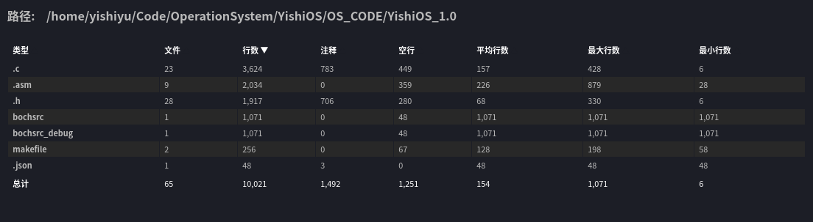
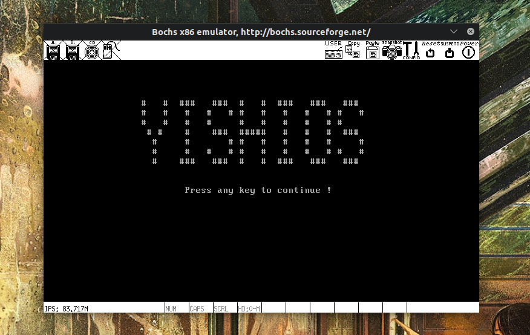
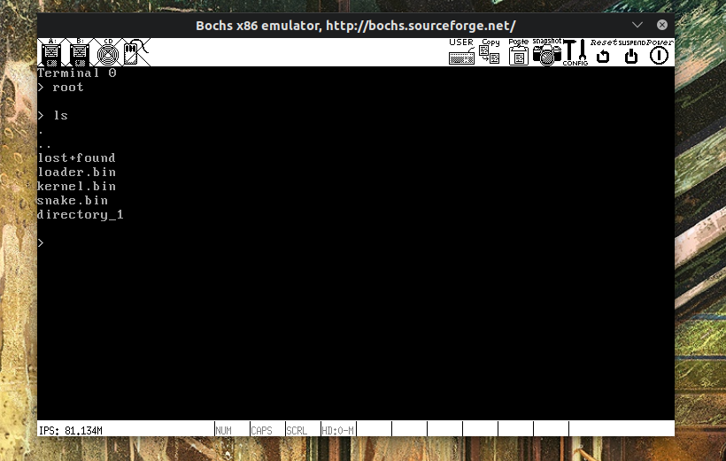
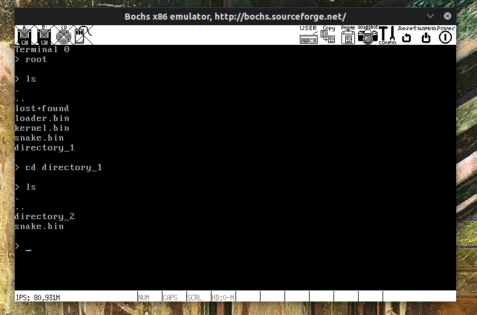
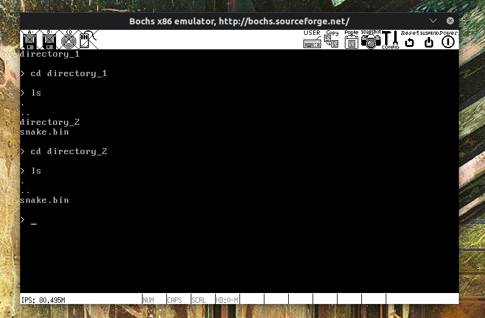
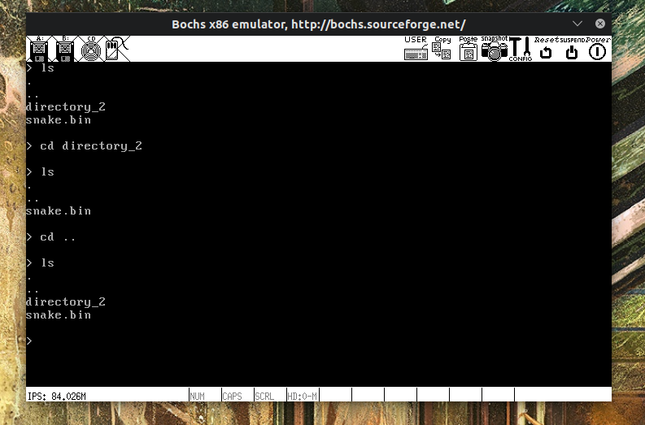
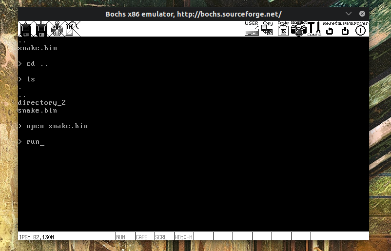
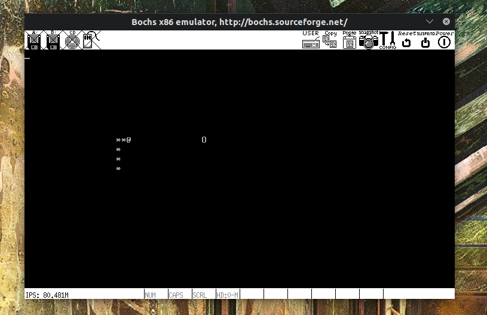
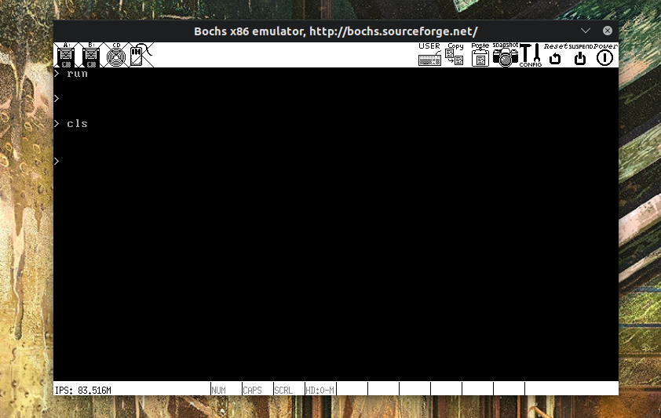

# YishiOS

## 1. 总体目标

1. 实现微内核(至少部分实现)
2. 硬盘文件系统采用 ext2 格式 (亲测 5.0 内核支持挂载 ext2 格式虚拟硬盘)
3. 支持 GUI 界面(这个留到下个版本吧)
4. 可以运行贪吃蛇游戏(这个要求只需要文件系统可以读取文件和文件夹就行了)

## 2. 进度表

|           task           | status |
| :----------------------: | :----: |
|         启动扇区         |  DONE  |
|         加载内核         |  DONE  |
|         启动中断         |  DONE  |
|         进程管理         |  DONE  |
|       输入输出系统       |  DONE  |
| 系统调用(包括进程间通信) |  DONE  |
|       调整系统结构       |  DONE  |
|   EXT2 文件系统(只读)    |  DONE  |
|  内存管理(运行用户程序)  |  DONE  |
|   运行贪吃蛇(基本功能)   |  DONE  |
|         安装系统         |  Orz   |

## 3. 合影留念

呜呜呜,装不上物理机了

泪目合影留念

撒花完结

除去两个 bochs 的设置文件(bochsrc bochsrc_debug),一共约 8000 行

1. 开机界面

   

2. 进入根目录

   

3. 进入子目录,回到上一级目录

     
     
   

4. 打开游戏,运行游戏,退出游戏

     
     
   

5. 清空屏幕,使用方向键滚动屏幕

     
   
